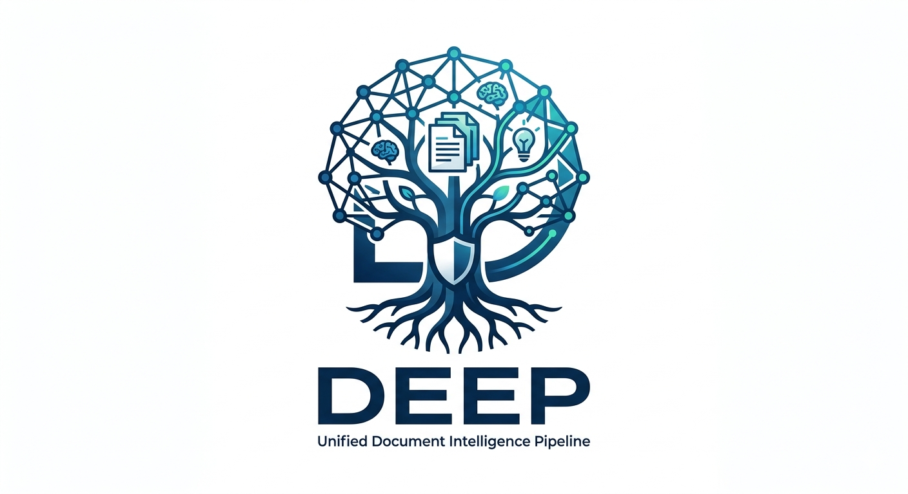
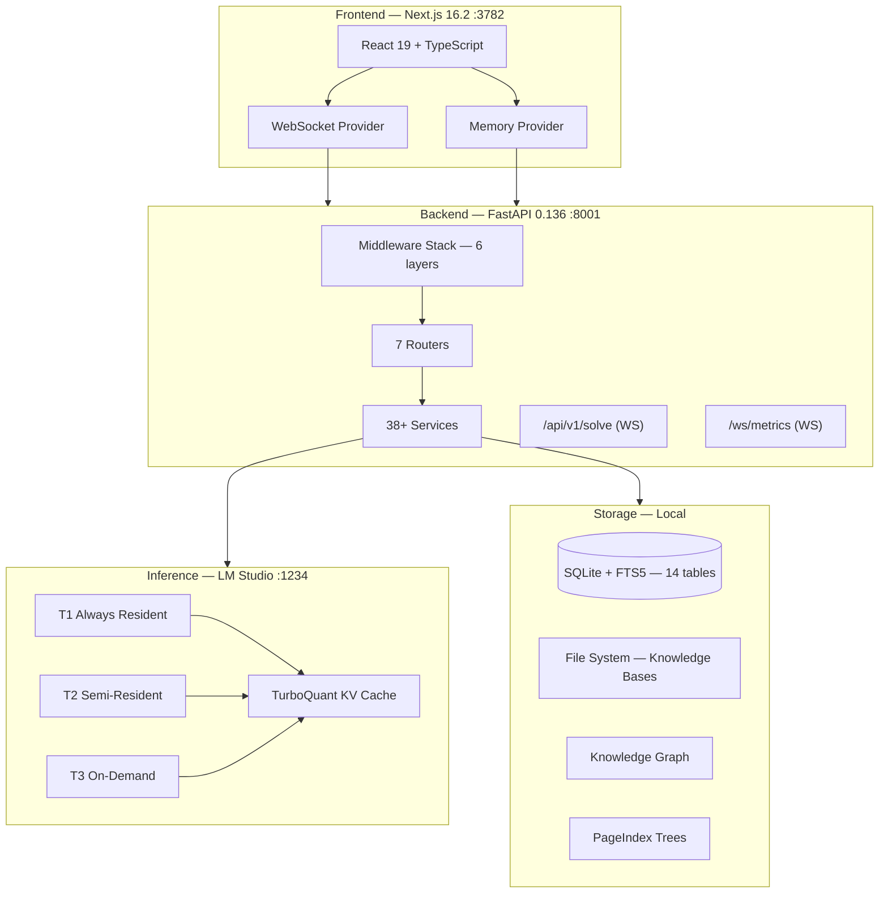
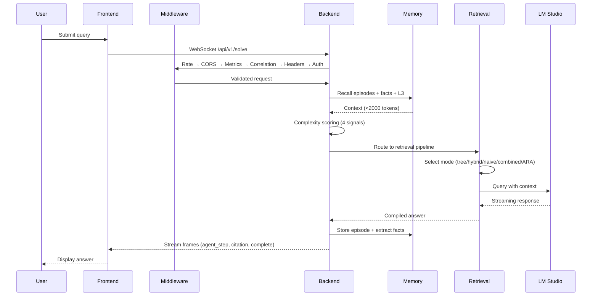
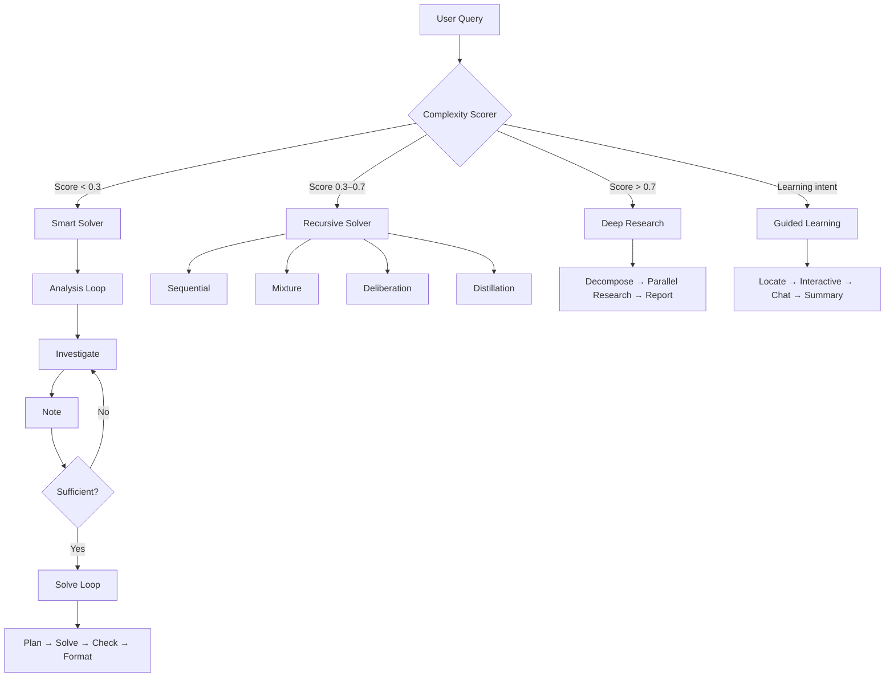
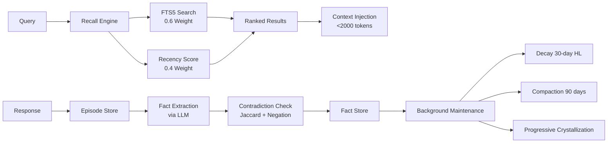
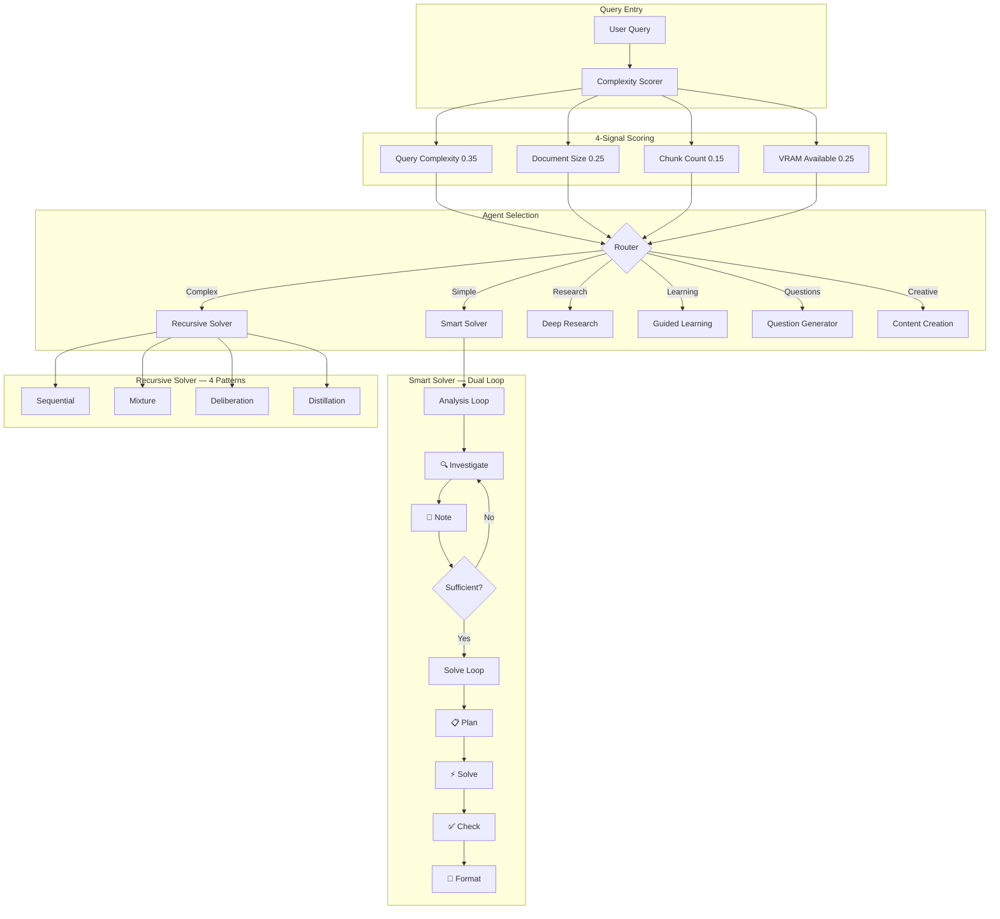
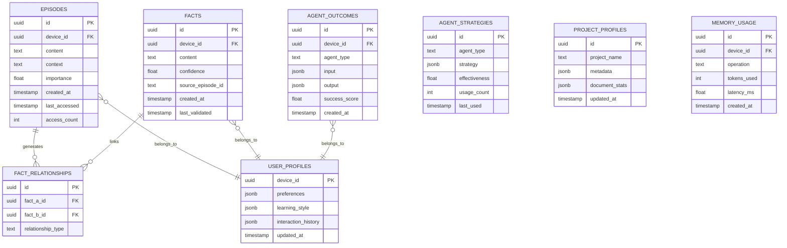

<p align="center">
  
</p>

<h1 align="center">DEEP</h1>

<p align="center"><em>Unified Document Intelligence Pipeline</em></p>


-green)


DEEP is a local-first AI platform that merges document intelligence, multi-agent reasoning, and persistent memory into a single system. It runs entirely on your hardware — no cloud, no data leakage. Upload documents, build hierarchical indexes, and interact with specialized agents that research, tutor, generate, and solve problems using your local LLM.

## Why DEEP Exists

Modern AI tools force a choice: powerful cloud APIs that send your data elsewhere, or local models that lack the orchestration to do anything useful with them. DEEP bridges this gap. It pairs local inference (via LM Studio, Ollama, or llama.cpp) with a full agent system, structured retrieval pipeline, and persistent memory — all running on your own machine.

The result is a platform where a student can upload lecture notes and get guided tutoring, a researcher can compile deep multi-source analysis, and a developer can query their codebase through a knowledge graph — without any data leaving their network. Every component, from the 3-tier model manager that balances VRAM across always-resident and on-demand models, to the 8-table memory system that tracks episodic recall and semantic facts, is designed for the constraints and strengths of consumer hardware.

## Key Features

| Feature | Description |
|---------|-------------|
| **Local-First Inference** | Connects to LM Studio, Ollama, or llama.cpp. No cloud dependency. Zero data leakage. |
| **3-Tier Model Management** | Always-resident (T1), semi-resident (T2), on-demand (T3) with VRAM-aware loading and eviction. |
| **5 Retrieval Modes** | Tree (PageIndex LLM reasoning), hybrid (vector + keyword RRF), naive (vector only), combined, and ARA. |
| **Dual-Loop Smart Solver** | Analysis loop (Investigate + Note) feeds Solve loop (Plan + Solve + Check + Format) for complex tasks. |
| **Recursive Multi-Agent Solver** | 4 collaboration patterns: Sequential, Mixture, Deliberation, Distillation from RecursiveMAS research. |
| **Deep Research Pipeline** | 3-phase: Decompose → Parallel Research → Report with source attribution. |
| **Guided Learning System** | 4-agent pipeline: Locate → Interactive → Chat → Summary for adaptive tutoring. |
| **Persistent Memory** | 10-table SQLite with episodic recall, semantic facts, contradiction detection, staged observations, and background maintenance. |
| **Knowledge Graph** | Entity-relation graph for dual-index RAG (KG + Dense Embeddings), enabling graph-based retrieval. |
| **Progressive Crystallization** | Observations staged before permanent storage, crystallized on closure signals. |
| **TurboQuant KV Cache** | 3-4 bit KV cache quantization reducing VRAM usage 40-50% with minimal quality loss. |
| **Real-Time Observability** | Prometheus metrics, OpenTelemetry tracing, WebSocket telemetry, VRAM pressure monitoring. |
| **ARA Knowledge Compiler** | Converts documents into Logic, Solution, Trace, and Evidence layers. |
| **Self-Validating Pipeline** | Built-in validation framework with 556 backend tests and 8 frontend tests. |
| **Hardened Docker Deployment** | Read-only containers, capability dropping, resource limits, healthchecks, blue-green zero-downtime. |
| **11 Inference Providers** | Local: LM Studio, Ollama, llama.cpp. Cloud: OpenAI, Anthropic, Gemini, Mistral, OpenRouter, and more. |
| **Device-Scoped Privacy** | UUID v4 per device, no cross-device data leakage, OS keyring integration. |
| **Property-Based Testing** | Hypothesis-powered tests for data transformations, security invariants, and prompt registry. |
| **Contract Testing** | Frontend/backend API schema validation ensuring type safety across the stack. |
| **shadcn/ui Design System** | Base-Nova style with @base-ui/react primitives, dark-only oklch theme, 18 UI components. |
| **Component Decomposition** | Solve page: 987→347 lines (9 components). Models page: 932→230 lines (4 components + 1 utility). |
| **Shared Components** | KbSelector shared across ChatSessionSidebar and SourcesSidebar for KB selection. |
| **Sonner Toasts** | Unified toast system across all 8 pages (chat, solve, research, cowriter, knowledge, guide, models, documents). |
| **Collaboration Patterns** | Sequential, Mixture of Experts, Deliberation, Distillation — with in-app explanations. |
| **Autoresearch System** | Three-file architecture (instructions, prompts, scoring) for iterative quality improvement. |

## Architecture

> Full architecture details: [ARCHITECTURE.md](ARCHITECTURE.md)

### System Overview



### Request Flow



### Agent Routing



### Memory Flow



### Middleware Stack

| # | Layer | File | Purpose |
|---|-------|------|---------|
| 1 | Rate Limiting | `middleware/rate_limit.py` | SlowAPI, 100/min per IP |
| 2 | CORS | `middleware/cors.py` | Localhost origin pinning |
| 3 | Metrics | `services/metrics.py` | Prometheus counters/histograms |
| 4 | Correlation | `middleware/correlation.py` | X-Request-ID + ContextVar |
| 5 | Security Headers | `middleware/headers.py` | CSP, HSTS, X-Frame, COOP |
| 6 | Auth | `middleware/auth.py` | Token validation (3 methods) |

### Service Categories

| Category | Services | Key Files |
|----------|----------|-----------|
| **Inference** | LM Studio client, Model Manager (3-tier), Model Discovery, VRAM Monitor, Embedding Service, Response Cache, Prompt Registry | `lm_studio_client.py`, `model_manager.py`, `vram_monitor.py` |
| **Retrieval & RAG** | Retrieval Pipeline, Query Router, Complexity Scorer, Tree Search, Vector KB, Hybrid RAG, PageIndex Generator, Knowledge Graph, RAG Eval | `retrieval_service.py`, `tree_search.py`, `vector_kb.py`, `knowledge_graph.py` |
| **Agents** | Solve Orchestrator (dual-loop), Recursive Solver (4-pattern), Deep Research, Guided Learning, Question Generator, Content Creation, ARA Compiler | `solve_orchestrator.py`, `recursive_solver.py`, `deep_research.py` |
| **Memory** | Memory Service (14 tables), Memory Context, Memory Maintenance, Fact Extractor | `memory_service.py`, `memory_context.py`, `fact_extractor.py` |
| **Document Processing** | Document Processor, Text Extractor, Text Chunker, OCR Engine | `document_processor.py`, `text_chunker.py`, `ocr_engine.py` |
| **Security** | Security (SSRF), Secrets (keyring), Audit | `security.py`, `secrets.py`, `audit.py` |
| **Observability** | Metrics (Prometheus), Telemetry (OpenTelemetry), Alerting, Logging | `metrics.py`, `telemetry.py`, `alerting.py` |
| **Infrastructure** | Service Registry + DI, Backup, Benchmark Runner, Session Cleanup, Task Registry, Task WAL | `base.py`, `backup.py`, `task_wal.py` |

### Memory Tables (14)

| Table | Purpose |
|-------|---------|
| `episodes` | Chat/session history with query, answer, agents, rating |
| `episode_chunks` + `episodes_fts` | FTS5 full-text search on episodes |
| `facts` | Extracted knowledge with confidence + provenance |
| `fact_chunks` + `facts_fts` | FTS5 full-text search on facts |
| `user_profiles` | Per-device JSON profiles with staleness tracking |
| `agent_outcomes` | Agent performance records |
| `agent_strategies` | Best-strategy aggregation per agent type |
| `project_profiles` | Global KB metadata |
| `staged_observations` | Progressive crystallization buffer |
| `dead_ends` | Failed research paths + lessons |
| `user_l3` | L3 cross-surface synthesis (4 slots) |
| `provenance_log` | Audit trail for provenance upgrades |

## Repository Structure

```
Deep/
├── .env.example                        # Environment template (40+ vars)
├── .github/workflows/
│   └── production-readiness.yml        # CI/CD: 11 jobs (lint, test, security, Docker, SBOM)
├── docker-compose.yml                  # Development
├── docker-compose.prod.yml             # Production (read-only, caps, health checks)
├── docker-compose.blue-green.yml       # Blue-green (zero-downtime, nginx)
├── scripts/
│   ├── orchestrate.py                  # Blue-green deployment orchestrator
│   ├── deploy-blue-green.sh            # Deploy wrapper
│   ├── nginx-blue-green.conf           # Nginx config for blue-green
│   └── generate_hashed_requirements.py # Supply-chain: hashed requirements
├── backend/                            # FastAPI Python 3.14 backend
│   ├── Dockerfile                      # Python 3.12-slim, non-root, health check
│   ├── pyproject.toml                  # Project config + tool settings
│   ├── requirements.txt                # 67 pinned production packages
│   ├── requirements-dev.txt            # Dev/test packages
│   ├── app/
│   │   ├── main.py                     # Entry point (FastAPI + lifespan)
│   │   ├── config.py                   # pydantic-settings (40+ env vars)
│   │   ├── state.py                    # 11 global singletons
│   │   ├── lifespan.py                 # Startup/shutdown orchestration
│   │   ├── dependencies.py             # DI container (singleton/transient)
│   │   ├── websocket_handlers.py       # /api/v1/solve + /ws/metrics
│   │   ├── middleware/                  # 6 middleware layers
│   │   │   ├── auth.py                 # Token validation (3 methods)
│   │   │   ├── cors.py                 # Localhost origin pinning
│   │   │   ├── rate_limit.py           # SlowAPI 100/min per IP
│   │   │   ├── correlation.py          # X-Request-ID + ContextVar
│   │   │   └── headers.py             # CSP, HSTS, X-Frame, COOP
│   │   ├── routers/                    # 7 API routers
│   │   │   ├── knowledge.py            # Upload, KB CRUD, PageIndex
│   │   │   ├── system.py               # Health, config, models, VRAM, GDPR
│   │   │   ├── agent.py                # Research, questions, learning, notebooks
│   │   │   ├── retrieval.py            # 5-mode retrieval pipeline
│   │   │   ├── query.py                # HTTP Q&A (non-streaming)
│   │   │   ├── memory.py               # Recall, episodes, facts, profiles
│   │   │   └── validation_routes.py    # Self-validation framework
│   │   ├── services/                   # 38+ business logic services
│   │   │   ├── lm_studio_client.py     # LM Studio API client (httpx)
│   │   │   ├── model_manager.py        # 3-tier model lifecycle
│   │   │   ├── vram_monitor.py         # pynvml GPU pressure (4 levels)
│   │   │   ├── solve_orchestrator.py   # Dual-loop smart solver
│   │   │   ├── recursive_solver.py     # 4-pattern multi-agent
│   │   │   ├── deep_research.py        # 3-phase research pipeline
│   │   │   ├── guided_learning.py      # 4-agent adaptive tutoring
│   │   │   ├── memory_service.py       # SQLite+FTS5 (14 tables)
│   │   │   ├── knowledge_graph.py      # Entity-relation KG
│   │   │   ├── tree_search.py          # PageIndex tree reasoning
│   │   │   ├── vector_kb.py            # Local numpy vector store
│   │   │   ├── hybrid_rag.py           # RRF vector + keyword merge
│   │   │   ├── document_processor.py   # PDF/DOCX/TXT/MD extraction
│   │   │   ├── agent_permissions.py    # Sliding window rate limiter + RBAC
│   │   │   ├── input_origin.py         # ContextVar-based request origin tracking
│   │   │   ├── rho_service.py          # RHO coreset selection (DPP greedy)
│   │   │   ├── failure_attribution.py  # MAST taxonomy + binary search attribution
│   │   │   ├── entropy_auditor.py      # Severity-weighted entropy scoring
│   │   │   ├── intervention_logger.py  # Human-in-the-loop intervention tracking
│   │   │   ├── security.py             # SSRF, path sanitize, auth
│   │   │   ├── secrets.py              # OS keyring integration
│   │   │   ├── metrics.py              # Prometheus + MetricsMiddleware
│   │   │   ├── task_wal.py             # Write-ahead log (crash recovery)
│   │   │   └── ... (18 more services)
│   │   ├── validation/                 # Self-validation framework
│   │   │   ├── baselines.py            # Thresholds + data classes
│   │   │   ├── config_validator.py     # Static config analysis
│   │   │   ├── coverage_tracker.py     # pytest coverage measurement
│   │   │   ├── health_checker.py       # LM Studio + Phase 10 checks
│   │   │   ├── remediation_tracker.py  # Sprint progress tracking
│   │   │   ├── runner.py               # CLI orchestrator
│   │   │   └── validation_routes.py    # REST API endpoints
│   │   └── prompts/                    # YAML prompt templates
│   ├── tests/                          # 62 test files, 556 tests
│   │   ├── conftest.py                 # Shared fixtures (real services, no mocks)
│   │   ├── test_memory_service.py      # Memory core operations
│   │   ├── test_solve_orchestrator.py  # Smart solver pipeline
│   │   ├── test_contract.py            # API contract testing
│   │   ├── test_property_based.py      # Hypothesis property tests
│   │   ├── locust_load.py              # Locust load testing
│   │   └── ... (57 more test files)
│   └── turboquant_plus/                # KV cache quantization (embedded repo)
├── frontend/                           # Next.js 16.2 TypeScript frontend
│   ├── Dockerfile                      # Multi-stage Node.js 20 build
│   ├── package.json                    # 15 deps + 14 devDeps
│   ├── components.json                 # shadcn/ui config (base-nova, Tailwind v4)
│   ├── app/
│   │   ├── layout.tsx                  # Root layout (TooltipProvider + Toaster)
│   │   ├── globals.css                 # Dark-only oklch design tokens
│   │   ├── page.tsx                    # Redirects to /chat
│   │   └── (platform)/
│   │       ├── layout.tsx              # App shell (sidebar, panels, navigation)
│   │       ├── chat/page.tsx           # Chat + Smart Solve streaming
│   │       ├── solve/page.tsx          # Recursive solver UI (decomposed, 347 lines)
│   │       ├── research/page.tsx       # Deep research pipeline
│   │       ├── guide/page.tsx          # Guided learning sessions
│   │       ├── questions/page.tsx      # Question generator
│   │       ├── notebooks/page.tsx      # Notebooks + CoWriter + IdeaGen
│   │       ├── documents/page.tsx      # Document upload + management
│   │       ├── knowledge/page.tsx      # KB viewer + PageIndex trees
│   │       ├── dashboard/page.tsx      # Real-time telemetry
│   │       ├── models/page.tsx         # Model management (decomposed, 230 lines)
│   │       └── settings/page.tsx       # System configuration
│   ├── components/                     # Reusable UI components
│   │   ├── ui/                         # 18 shadcn/ui base components
│   │   │   ├── badge.tsx              # Badge
│   │   │   ├── button.tsx             # Button
│   │   │   ├── card.tsx               # Card
│   │   │   ├── dialog.tsx             # Dialog (base-ui/react)
│   │   │   ├── input.tsx              # Input
│   │   │   ├── label.tsx              # Label
│   │   │   ├── select.tsx             # Select
│   │   │   ├── sheet.tsx              # Sheet (side drawer)
│   │   │   ├── skeleton.tsx           # Skeleton loading
│   │   │   ├── sonner.tsx             # Sonner toast (dark-only)
│   │   │   ├── tabs.tsx               # Tabs
│   │   │   ├── textarea.tsx           # Textarea
│   │   │   ├── tooltip.tsx            # Tooltip
│   │   │   └── ... (5 more)
│   │   ├── solve/                      # 12 components (9 new + 3 pre-existing)
│   │   │   ├── tree-item.tsx          # PageIndex tree item
│   │   │   ├── sources-sidebar.tsx    # Document sources panel
│   │   │   ├── solve-toolbar.tsx      # Agent selection toolbar
│   │   │   ├── solve-composer.tsx     # Composer with collaboration patterns
│   │   │   ├── suggested-prompts.tsx  # Suggested prompt chips
│   │   │   ├── streaming-pipeline.tsx # Real-time agent step streaming
│   │   │   ├── error-banner.tsx       # Error display banner
│   │   │   ├── synthesis-result.tsx   # Final synthesis with citations
│   │   │   ├── page-index-sidebar.tsx # PageIndex tree navigation
│   │   │   ├── agent-step-display.tsx # Agent step visualization
│   │   │   ├── citation-list.tsx      # Citation list
│   │   │   └── solve-input.tsx        # Input area
│   │   ├── models/                     # 4 components (decomposed from 932-line page)
│   │   │   ├── models-header.tsx      # Header with telemetry bar
│   │   │   ├── connection-rail.tsx    # Provider connection rail
│   │   │   ├── filter-toolbar.tsx     # Search + param category filters
│   │   │   └── tier-slot-card.tsx     # Generic T1/T2/T3 tier slot card
│   │   ├── shared/                     # Shared cross-page components
│   │   │   └── kb-selector.tsx        # KB selector (Chat + Sources sidebars)
│   │   ├── deep/                       # DEEP-specific visual components
│   │   │   ├── agent-step-card.tsx    # Agent step visualization card
│   │   │   ├── citation-inline.tsx    # Inline citation display
│   │   │   ├── streaming-indicator.tsx# Streaming status indicator
│   │   │   └── index.ts              # Barrel exports
│   │   ├── chat/                       # Chat components
│   │   │   ├── ChatSessionSidebar.tsx # Session list + KB selector
│   │   │   └── ChatInferenceDisplay.tsx# Inference display
│   │   ├── dashboard/                  # Telemetry visualizations
│   │   ├── documents/                  # Upload + list
│   │   └── error-boundary.tsx          # Global error boundary
│   ├── providers/                      # WebSocket + Memory contexts
│   ├── lib/                            # API clients + utilities
│   │   ├── config.ts                  # secureFetch + API_BASE_URL
│   │   ├── knowledge.ts               # KB API client
│   │   ├── estimate-vram.ts           # VRAM estimation (extracted from models)
│   │   └── utils.ts                   # cn() utility (tailwind-merge + clsx)
│   ├── types/                          # TypeScript interfaces
│   └── __tests__/                      # 8 test files, 43 tests
├── agent_instructions.md               # Autoresearch INSTRUCTIONS (human-only)
├── agent_prompts.py                    # Autoresearch PROMPTS (agent-editable)
├── agent_scoring.py                    # Autoresearch SCORING (locked)
├── ACKNOWLEDGEMENTS.md                 # Research attributions + license compliance
├── ARCHITECTURE.md                     # Full architecture documentation
├── SECURITY.md                         # Security policy + vulnerability status
└── CONTRIBUTING.md                     # Contribution guide
```

## Installation

### Prerequisites

| Component | Minimum | Recommended |
|-----------|---------|-------------|
| GPU VRAM | 6 GB | 12+ GB |
| RAM | 8 GB | 16+ GB |
| Storage | 10 GB | 50+ GB (SSD) |
| CPU | 4 cores | 8+ cores |
| Python | 3.12+ | 3.12+ |
| Node.js | 20+ | 22+ |
| LM Studio | Latest | Latest (with server enabled) |

### Quick Start with Docker

```bash
# Clone the repository
git clone https://github.com/ShinShekai/Deep.git
cd Deep

# Copy environment template
cp .env.example .env

# Start development stack
docker compose up -d

# Open browser
# Frontend: http://localhost:3782
# Backend:  http://localhost:8001
# Metrics:  http://localhost:8001/metrics
```

### Manual Setup

```bash
# 1. Clone and configure
git clone https://github.com/ShinShekai/Deep.git
cd Deep
cp .env.example .env

# 2. Backend setup
cd backend
python -m venv .venv
.venv\Scripts\activate          # Windows
# source .venv/bin/activate     # Linux/Mac
pip install -r requirements.txt

# 3. Frontend setup
cd ../frontend
npm install

# 4. Start LM Studio (download from lmstudio.ai)
#    - Enable local server on port 1234
#    - Load a model (Qwen3-1.7B-Q4_K_M recommended for T1)

# 5. Start backend
cd ../backend
uvicorn app.main:app --host 0.0.0.0 --port 8001

# 6. Start frontend (new terminal)
cd ../frontend
npm run dev
```

### System Dependencies (Linux)

```bash
sudo apt-get update
sudo apt-get install -y \
  python3.12 python3.12-venv python3-pip \
  nodejs npm \
  tesseract-ocr \
  libgl1-mesa-glx libglib2.0-0 \
  poppler-utils \
  libreoffice-core
```

### System Dependencies (Windows)

1. Install [Tesseract OCR](https://github.com/UB-Mannheim/tesseract/wiki) — add to PATH
2. Install Python 3.12+ from python.org
3. Install Node.js 20+ from nodejs.org
4. Install [LM Studio](https://lmstudio.ai) and enable local server

## Quick Start

```bash
# 1. Start LM Studio with a model loaded on localhost:1234

# 2. Start the backend
cd backend
uvicorn app.main:app --port 8001

# 3. Start the frontend (new terminal)
cd frontend
npm run dev

# 4. Open http://localhost:3782

# 5. Upload a document via the Documents page, then ask a question
```

## Configuration

### Environment Variables

#### LM Studio Connection

| Variable | Default | Description |
|----------|---------|-------------|
| `LLM_HOST` | `http://localhost:1234` | LM Studio API endpoint |
| `LLM_PORT` | `1234` | LM Studio port |
| `LLM_API_KEY` | `lm-studio` | API key (LM Studio uses dummy) |
| `LLM_MODEL` | `Qwen3-1.7B-Q4_K_M` | Primary LLM model |
| `EMBEDDING_HOST` | `http://localhost:1234` | Embedding model endpoint |
| `EMBEDDING_API_KEY` | `lm-studio` | Embedding API key |
| `EMBEDDING_MODEL` | `text-embedding-qwen3-embedding-8b` | Embedding model name |

#### TurboQuant KV Cache

| Variable | Default | Description |
|----------|---------|-------------|
| `TURBOQUANT_ENABLED` | `True` | Enable KV cache quantization |
| `TURBOQUANT_BITS` | `4` | Quantization bit width (3 or 4) |
| `TURBOQUANT_RESIDUAL_WINDOW` | `256` | Residual window size |
| `TURBOQUANT_TIER` | `auto` | Quantization tier |

#### VRAM Management

| Variable | Default | Description |
|----------|---------|-------------|
| `VRAM_SAFETY_MARGIN_PCT` | `15` | VRAM safety margin percentage |
| `T2_TTL` | `600` | Tier 2 model time-to-live (seconds) |
| `T3_TTL` | `300` | Tier 3 model time-to-live (seconds) |

#### PageIndex

| Variable | Default | Description |
|----------|---------|-------------|
| `PAGEINDEX_MODEL` | `""` | Model for tree generation |
| `PAGEINDEX_MAX_PAGES_PER_NODE` | `10` | Maximum pages per tree node |
| `PAGEINDEX_MAX_TOKENS_PER_NODE` | `20000` | Maximum tokens per tree node |

#### System

| Variable | Default | Description |
|----------|---------|-------------|
| `BACKEND_PORT` | `8001` | FastAPI server port |
| `FRONTEND_PORT` | `3782` | Next.js development port |
| `METRICS_INTERVAL` | `2.0` | Metrics broadcast interval (seconds) |

#### Security

| Variable | Default | Description |
|----------|---------|-------------|
| `WS_AUTH_TOKEN` | auto-generated | WebSocket authentication token |
| `UDIP_RATE_LIMIT` | `100/minute` | Rate limiting per IP |
| `UDIP_HSTS_ENABLED` | `false` | HSTS header (enable only with HTTPS) |
| `UDIP_ALLOW_LOCAL_LLM` | `1` | Allow localhost LLM connections |

#### Logging

| Variable | Default | Description |
|----------|---------|-------------|
| `UDIP_LOG_LEVEL` | `INFO` | Logging level (DEBUG/INFO/WARNING/ERROR) |
| `UDIP_LOG_FORMAT` | `text` | Log format (text/json) |

#### Alerting

| Variable | Default | Description |
|----------|---------|-------------|
| `UDIP_VRAM_WARN_PCT` | `85` | VRAM warning threshold |
| `UDIP_VRAM_CRIT_PCT` | `95` | VRAM critical threshold |
| `UDIP_ERROR_RATE_WARN` | `10` | Error rate warning threshold |

#### Session Cleanup

| Variable | Default | Description |
|----------|---------|-------------|
| `UDIP_SESSION_MAX_AGE_DAYS` | `30` | Session cleanup age (days) |

#### Memory System

| Variable | Default | Description |
|----------|---------|-------------|
| `memory_enabled` | `True` | Enable memory subsystem |
| `memory_db_path` | `data/memory/deep_memory.db` | SQLite memory database path |
| `memory_max_episodes_recall` | `5` | Maximum episodes returned per recall |
| `memory_max_facts_recall` | `10` | Maximum facts returned per recall |
| `memory_fact_confidence_threshold` | `0.2` | Minimum confidence for stored facts |
| `memory_decay_rate` | `0.1` | Memory decay rate |
| `memory_extraction_model_tier` | `1` | Model tier for fact extraction |

#### OCR

| Variable | Default | Description |
|----------|---------|-------------|
| `OCR_BACKEND` | `pytesseract` | OCR engine (`pytesseract` or `easyocr`) |

#### Frontend

| Variable | Description |
|----------|-------------|
| `NEXT_PUBLIC_API_URL` | Backend API URL (`http://localhost:8001/api/v1`) |
| `NEXT_PUBLIC_WS_URL` | WebSocket URL (`ws://localhost:8001`) |
| `NEXT_PUBLIC_WS_AUTH_TOKEN` | WebSocket auth token |

### Configuration Files

- `.env` — Active configuration (gitignored). Created by copying `.env.example`.
- `.env.example` — Template with all variables and defaults.
- `backend/app/config.py` — Pydantic Settings class that reads from `.env` and environment.

### Secrets Management

DEEP generates an auth token on first startup and persists it to `data/.auth_token`. For API key storage, it integrates with the OS keyring:

- **Windows**: Windows Credential Manager
- **macOS**: macOS Keychain
- **Linux**: libsecret (GNOME Keyring / KWallet)

Keys are never written to disk in plaintext. Token rotation is available via `POST /api/v1/secrets/rotate`.

## Usage

### Document Upload

```bash
# Upload a PDF
curl -X POST http://localhost:8001/api/v1/knowledge/upload \
  -F "file=@document.pdf" \
  -F "kb_name=my-kb"

# Check task status
curl http://localhost:8001/api/v1/knowledge/tasks/{task_id}

# List all documents
curl http://localhost:8001/api/v1/knowledge/documents

# Get PageIndex tree
curl http://localhost:8001/api/v1/knowledge/pageindex/my-kb
```

### Smart Solver

```bash
# Connect via WebSocket
wscat -c "ws://localhost:8001/api/v1/solve?token=YOUR_TOKEN"

# Send a problem (bidirectional stream)
> {"query": "Explain the time complexity of quicksort", "context": "..."}
```

### Deep Research

```bash
# Start a research task
curl -X POST http://localhost:8001/api/v1/research \
  -H "Content-Type: application/json" \
  -d '{"topic": "Impact of KV cache compression on LLM throughput"}'

# Poll results
curl http://localhost:8001/api/v1/research/{task_id}
```

### Guided Learning

```bash
# Start a guided learning session
curl -X POST http://localhost:8001/api/v1/guide/start \
  -H "Content-Type: application/json" \
  -d '{"topic": "Transformer attention mechanisms", "kb_name": "ml-notes"}'
```

### Question Generation

```bash
# Generate questions from a document
curl -X POST http://localhost:8001/api/v1/questions/generate \
  -H "Content-Type: application/json" \
  -d '{"doc_id": "doc_abc123", "count": 10, "difficulty": "medium"}'
```

### Content Creation

```bash
# Create a notebook
curl -X POST http://localhost:8001/api/v1/notebooks \
  -H "Content-Type: application/json" \
  -d '{"title": "Research Notes", "sources": ["doc_1", "doc_2"]}'

# Co-writer edit
curl -X POST http://localhost:8001/api/v1/cowriter/edit \
  -H "Content-Type: application/json" \
  -d '{"text": "Draft content...", "instruction": "Make it more technical"}'

# Idea generation
curl -X POST http://localhost:8001/api/v1/ideagen/generate \
  -H "Content-Type: application/json" \
  -d '{"topic": "novel approaches to KV cache compression", "count": 5}'
```

### Memory System

```bash
# Recall memories for a device
curl -X POST http://localhost:8001/api/v1/memory/recall \
  -H "Content-Type: application/json" \
  -d '{"device_id": "uuid-here", "query": "What did I learn about transformers?"}'

# Get memory stats
curl http://localhost:8001/api/v1/memory/stats/{device_id}

# Get user profile
curl http://localhost:8001/api/v1/memory/profile/{device_id}

# Trigger decay manually
curl -X POST http://localhost:8001/api/v1/memory/decay

# Search memory
curl -X POST http://localhost:8001/api/v1/memory/search \
  -H "Content-Type: application/json" \
  -d '{"device_id": "uuid-here", "query": "attention mechanism"}'
```

### Model Management

```bash
# List available models
curl http://localhost:8001/api/v1/models

# Discover models from LM Studio
curl http://localhost:8001/api/v1/models/discover

# Load a specific model
curl -X POST http://localhost:8001/api/v1/models/{model_id}/load

# Unload a model
curl -X POST http://localhost:8001/api/v1/models/{model_id}/unload

# Check VRAM status
curl http://localhost:8001/api/v1/vram/status
```

### Backup & GDPR

```bash
# Create a backup
curl -X POST http://localhost:8001/api/v1/backup

# List backups
curl http://localhost:8001/api/v1/backup

# Restore a backup
curl -X POST http://localhost:8001/api/v1/backup/{name}/restore

# Delete all user data (GDPR)
curl -X DELETE http://localhost:8001/api/v1/memory/episodes/{device_id}
```

## Agent System

### Architecture



### Smart Solver (Dual-Loop)

The Smart Solver uses a two-phase approach for complex problem-solving:

**Analysis Loop** — Gathers information before solving:
- **Investigate Agent**: Searches the knowledge base, retrieves relevant chunks, examines document structure
- **Note Agent**: Summarizes findings, extracts key facts, identifies gaps in understanding

The loop repeats until sufficient context is gathered (configurable iteration limit).

**Solve Loop** — Produces the answer:
- **Plan Agent**: Outlines the solution strategy, identifies required steps
- **Solve Agent**: Executes the plan, generates the response
- **Check Agent**: Validates the response against the original query, checks for completeness
- **Format Agent**: Structures the final output (markdown, code blocks, citations)

### Recursive Solver

Implements 4 collaboration patterns from the RecursiveMAS framework:

| Pattern | Description | Best For |
|---------|-------------|----------|
| **Sequential** | Agents process in chain, each building on the previous output | Step-by-step problems |
| **Mixture** | Multiple agents solve independently, outputs merged | Diverse perspectives needed |
| **Deliberation** | Agents debate and refine through multiple rounds | Controversial or nuanced topics |
| **Distillation** | Multiple agent outputs compressed into a single best answer | High-quality final output |

### Deep Research

3-phase pipeline for comprehensive research tasks:

1. **Decompose Phase**: Breaks the research topic into sub-questions with dependencies
2. **Parallel Research Phase**: Sub-questions researched concurrently across the knowledge base
3. **Report Compilation**: Results synthesized into a structured report with source attribution

### Guided Learning

4-agent adaptive tutoring system:

| Agent | Role | Interaction |
|-------|------|-------------|
| **Locate** | Finds relevant content in the knowledge base | Background |
| **Interactive** | Generates quizzes, exercises, and checkpoints | Active |
| **Chat** | Answers follow-up questions, explains concepts | Conversational |
| **Summary** | Compiles learning progress and knowledge gaps | Reporting |

### Question Generator

2-agent pipeline for assessment creation:

- **Generator Agent**: Produces questions of varying difficulty from source material
- **Validator Agent**: Checks question quality, accuracy, and appropriate difficulty level

### Content Creation

Three creative tools:

- **Notebook**: Structured document combining source material with AI-generated sections
- **CoWriter**: Collaborative writing with iterative refinement via instruction-guided edits
- **IdeaGen**: Brainstorming engine that generates novel ideas from topic seeds

### ARA Compiler

Converts documents into a 4-layer knowledge structure:

| Layer | Content | Purpose |
|-------|---------|---------|
| **Logic** | Core arguments, claims, and reasoning chains | Understanding the "why" |
| **Solution** | Methods, implementations, and approaches | Understanding the "how" |
| **Trace** | Experimental results, data points, evidence | Understanding the "what happened" |
| **Evidence** | Citations, references, supporting documents | Provenance and verification |

## Memory System

### Architecture



### Episodic Memory

Episodes capture interactions, decisions, and observations:

- **Storage**: Each episode includes content, context, importance score, and timestamp
- **Retrieval Scoring**: `0.6 × FTS5_full_text_rank + 0.4 × recency_decay`
- **Recency Decay**: Exponential decay based on time since last access
- **Access Tracking**: Every recall increments access count and updates last_accessed

### Semantic Memory (Facts)

Facts are extracted from episodes via the local LLM:

- **Extraction**: Background LLM call extracts structured facts from episode content
- **Confidence Scoring**: Each fact gets a confidence score (0.0–1.0)
- **Contradiction Detection**: Jaccard similarity + negation analysis identifies conflicting facts
- **Validation**: Facts can be re-validated against new episodes

### User Profiles

Auto-updated profiles tracking device-level preferences:

- Learning style preferences
- Interaction patterns
- Topic interests (inferred from query history)
- Response format preferences

### Agent Memory

Strategies learned from agent outcomes:

- Tracks which approaches work for which problem types
- Effectiveness scores updated after each agent run
- Strategies shared across users (global, not device-scoped)

### Maintenance

Background tasks keep memory healthy:

- **Decay**: Hourly, 30-day half-life reduces importance of old, unreferenced memories
- **Compaction**: Merges similar episodes older than 90 days
- **FTS5 Reindex**: Periodic reindexing for optimal search performance
- **Usage Tracking**: Logs all memory operations for observability

## Supported Models

### Tier System

| Tier | Name | VRAM Range | Concurrent Slots | TTL | Models |
|------|------|------------|-------------------|-----|--------|
| **T1** | Always Resident | 1–3.5 GB | 4 | Infinite | Qwen3-0.6B, Qwen3-1.7B, LFM2.5-1.2B, ReaderLM-v2 |
| **T2** | Semi-Resident | 4–9.5 GB | 2 | 600s | Qwen3-4B, Qwen3-8B, Nemotron-3-Nano-4B, DeepSeek-R1-Qwen3-8B |
| **T3** | On-Demand | 25–40 GB | 1 | 300s | Qwen3-14B, Qwen3.6-35B-A3B, Gemma-4-26B-A4B |

### Embedding Models

| Model | Dimension | Notes |
|-------|-----------|-------|
| `text-embedding-qwen3-embedding-8b` | 4096 | Default, highest quality |
| `Snowflake Arctic Embed M` | 768 | Balanced quality/speed |
| `nomic-embed-text-v1.5` | 768 | Lightweight, fast |
| `BGE-M3` | 1024 | Multilingual, dense + sparse |

### Cloud Providers (Optional)

| Provider | API Key Required | Notes |
|----------|------------------|-------|
| OpenAI | Yes | GPT-4o, GPT-4o-mini |
| Anthropic | Yes | Claude Sonnet, Claude Opus |
| Google Gemini | Yes | Gemini 2.5 Pro, Flash |
| Mistral | Yes | Mistral Large, Small |
| OpenRouter | Yes | Multi-provider gateway |
| OpenCode | No | Generic OpenAI-compatible |

## Integrations

### shadcn/ui Design System

- **Style**: Base-Nova — `@base-ui/react` primitives (NOT Radix UI)
- **Configuration**: `frontend/components.json` (base-nova, Tailwind v4, oklch)
- **Components installed**: badge, button, card, dialog, input, label, popover, scroll-area, select, separator, sheet, skeleton, sonner, switch, tabs, textarea, tooltip, accordion
- **Theme**: Dark-only oklch design tokens in `app/globals.css`
- **Utility**: `cn()` from `lib/utils.ts` (tailwind-merge + clsx)

### Sonner (Toast Notifications)

- **Website**: [sonner.emilkowal.ski](https://sonner.emilkawal.ski)
- **License**: MIT
- **Integration**: Unified toast system across all 8 pages. `toast()` from sonner, `<Toaster />` in root layout.
- **Pages migrated**: chat, solve, research, cowriter, knowledge, guide, models, documents

### Tailwind CSS v4

- **Website**: [tailwindcss.com](https://tailwindcss.com)
- **License**: MIT
- **Integration**: Utility-first CSS with oklch color system. No `tailwind.config.ts` — uses CSS-first configuration.
- **PostCSS**: `@tailwindcss/postcss` v4

### Lucide Icons

- **Website**: [lucide.dev](https://lucide.dev)
- **License**: ISC
- **Integration**: Icon library for all UI components. 1000+ consistent icons.

### LM Studio

- **Website**: [lmstudio.ai](https://lmstudio.ai)
- **License**: Proprietary (free for personal and commercial use)
- **Integration**: Primary local inference backend via OpenAI-compatible API. Chat completions, embeddings, and model management. DEEP uses `stream_chat()` API v1 endpoints.

### Ollama

- **Website**: [ollama.ai](https://ollama.ai)
- **License**: MIT
- **Integration**: Alternative local inference backend. Same OpenAI-compatible API format.

### llama.cpp

- **Repository**: [github.com/ggerganov/llama.cpp](https://github.com/ggerganov/llama.cpp)
- **License**: MIT
- **Integration**: Backend inference engine. TurboQuant+ has active PR preparation for upstream contribution.

### Cloud Providers (Optional)

| Provider | API Key Required | Notes |
|----------|------------------|-------|
| OpenAI | Yes | GPT-4o, GPT-4o-mini |
| Anthropic | Yes | Claude Sonnet, Claude Opus |
| Google Gemini | Yes | Gemini 2.5 Pro, Flash |
| Mistral | Yes | Mistral Large, Small |
| OpenRouter | Yes | Multi-provider gateway |
| OpenCode | No | Generic OpenAI-compatible |

### OCR

Two OCR backends supported:

- **pytesseract** (default): Tesseract-based, requires system installation
- **easyocr**: GPU-accelerated, no system dependency, slower cold start

### Prometheus

Metrics endpoint at `GET /metrics` exposes:

- Request counts and latencies (per endpoint)
- VRAM usage and pressure level
- Active model count per tier
- Memory system operations
- Error rates

### OpenTelemetry

Optional distributed tracing (disabled by default):

- Set `OTEL_EXPORTER_OTLP_ENDPOINT` to enable
- Graceful no-op when not configured
- Traces cover: query routing, retrieval, LLM calls, memory operations

## Development

### Project Setup

```bash
# Backend
cd backend
python -m venv .venv
.venv\Scripts\activate
pip install -r requirements.txt
pip install pytest pytest-asyncio pytest-cov

# Frontend
cd frontend
npm install
npm install -D vitest @testing-library/react
```

### Code Structure

- **Services**: Business logic in `backend/app/services/`. Each service is a module with async functions.
- **Routers**: HTTP endpoints in `backend/app/routers/`. Thin wrappers that delegate to services.
- **State**: Module-level singletons in `state.py`. Accessed via `from app.state import ...`.
- **Config**: Pydantic Settings in `config.py`. All env vars loaded here.
- **Components**: React components in `frontend/components/`. Reusable, typed with TypeScript.
- **Providers**: React context providers in `frontend/providers/`. WebSocket and Memory.

### Adding a New Service

1. Create `backend/app/services/my_service.py`
2. Define async functions (not classes) for each operation
3. Import state from `app.state` for shared singletons
4. Add router in `backend/app/routers/my_router.py`
5. Register router in `backend/app/main.py`
6. Write tests in `backend/tests/test_my_service.py`

### Adding a New Endpoint

1. Add route function in the appropriate router file
2. Use dependency injection for services
3. Add request/response models in `backend/app/validation/`
4. Write integration test in `backend/tests/`
5. Update this README with the new endpoint

## Build Process

### Docker Build

**Backend Dockerfile** (`backend/Dockerfile`):
- Base: `python:3.12-slim`
- Installs system deps (tesseract, poppler)
- Copies requirements, installs Python packages
- Runs as non-root user
- Healthcheck via `/api/v1/health`

**Frontend Dockerfile** (`frontend/Dockerfile`):
- Base: `node:22-slim`
- Multi-stage build (deps → build → production)
- Output: standalone Next.js
- Runs as non-root user

### CI/CD Pipeline

9-job GitHub Actions pipeline:

| Job | Description |
|-----|-------------|
| **Static Validation** | YAML, JSON, Dockerfile lint |
| **Tests** | Backend pytest + frontend vitest |
| **Lint** | Ruff (Python) + ESLint (TypeScript) |
| **Security Audit** | pip-audit + npm audit |
| **Docker Build** | Multi-platform image build |
| **Trivy Scan** | Container vulnerability scanning |
| **GHCR Push** | Push to GitHub Container Registry |
| **Locust Load** | 50-user load test against staging |
| **SBOM** | Software Bill of Materials generation |

### Blue-Green Deployment

Zero-downtime deployment using nginx:

1. Deploy new version to the inactive stack (blue or green)
2. Run healthchecks against the new stack
3. Switch nginx upstream to the new stack
4. Drain old stack connections
5. Shut down old stack

```bash
# Deploy blue-green
./scripts/deploy-blue-green.sh

# Nginx config
cat scripts/nginx-blue-green.conf
```

## Testing

### Backend Tests

```bash
cd backend

# Run all tests
pytest

# With coverage
pytest --cov=app --cov-report=html

# Run specific test file
pytest tests/test_memory_service.py

# Verbose output
pytest -v
```

61 test files covering:
- Service unit tests (memory, retrieval, agents)
- Integration tests (API endpoints)
- Security tests (SSRF, path traversal, auth)
- Performance tests (memory latency targets)

### Frontend Tests

```bash
cd frontend

# Run all tests
npm test

# Watch mode
npm test -- --watch

# Coverage
npm test -- --coverage
```

8 test files covering:
- Component rendering
- Provider behavior
- API client integration

### Load Testing

```bash
# Run Locust load test
cd tests
locust -f locustfile.py --host=http://localhost:8001

# Headless mode (50 users, 5 min)
locust -f locustfile.py --host=http://localhost:8001 \
  --headless -u 50 -r 10 --run-time 5m
```

### Security Auditing

```bash
# Python dependencies
pip-audit

# Node.js dependencies
npm audit

# Container scanning
trivy image deep-backend:latest
trivy image deep-frontend:latest
```

## Performance Considerations

### VRAM Management

DEEP monitors VRAM in real-time via pynvml and responds to 4 pressure levels:

| Level | Threshold | Action |
|-------|-----------|--------|
| **GREEN** | <70% | Normal operation, all tiers active |
| **YELLOW** | 70–85% | Pause T3 loading, extend T2 TTL |
| **ORANGE** | 85–93% | Evict T3 models, throttle T2 |
| **RED** | >93% | Evict T2 models, T1 only |

### TurboQuant

KV cache quantization reduces VRAM usage for long-context inference:

- **PolarQuant**: Random rotation + Beta-distributed coordinates + Lloyd-Max scalar quantization
- **Bit widths**: 3-bit (aggressive) or 4-bit (balanced)
- **Benefit**: 40–50% VRAM reduction on KV cache with minimal quality loss
- **Integration**: Applied automatically when `TURBOQUANT_ENABLED=True`

### Caching

- **LRU Model Cache**: Recently used models kept resident based on tier TTL
- **Embedding Cache**: Vector embeddings cached to avoid recomputation
- **Query Cache**: Repeated queries served from cache (configurable TTL)

### Concurrency

3-tier semaphore system prevents VRAM overcommit:

- **T1 Semaphore**: 4 concurrent requests (always available)
- **T2 Semaphore**: 2 concurrent requests (after model is loaded)
- **T3 Semaphore**: 1 concurrent request (loaded on-demand, evicted after TTL)

## Security

### Authentication

3 methods supported (checked in order):

1. **Header**: `X-DEEP-API-KEY: <token>`
2. **Bearer**: `Authorization: Bearer <token>`
3. **Query**: `?token=<token>`

Token is auto-generated on first startup, persisted to `data/.auth_token`. Constant-time comparison via `hmac.compare_digest` prevents timing attacks.

### SSRF Protection

All outgoing HTTP requests are validated:

- DNS resolution checked before connection
- Cloud metadata endpoints blocked (`169.254.169.254`, `fd00:ec2::254`)
- Private IP ranges blocked (10.x, 172.16-31.x, 192.168.x, 127.x)
- Redirects followed with same validation

### Path Sanitization

File operations use safe path resolution:

- `safe_name()`: Strips path separators and special characters from filenames
- `safe_doc_id()`: Validates document ID format (alphanumeric + hyphens only)
- `resolve_within()`: Ensures resolved path stays within allowed directory

### Rate Limiting

SlowAPI integration with configurable limits:

- Default: 100 requests per minute per IP
- Configurable via `UDIP_RATE_LIMIT`
- Returns 429 with `Retry-After` header

### Security Headers

All responses include:

| Header | Value |
|--------|-------|
| `Content-Security-Policy` | `default-src 'self'; script-src 'self'; style-src 'self' 'unsafe-inline'` |
| `X-Frame-Options` | `DENY` |
| `X-Content-Type-Options` | `nosniff` |
| `X-XSS-Protection` | `1; mode=block` |
| `Referrer-Policy` | `strict-origin-when-cross-origin` |
| `Cross-Origin-Opener-Policy` | `same-origin` |
| `Strict-Transport-Security` | `max-age=63072000` (opt-in via `UDIP_HSTS_ENABLED`) |

### Secrets Management

- OS keyring integration (Windows Credential Manager / macOS Keychain / libsecret)
- Auth token auto-generated and persisted to `data/.auth_token`
- Token rotation via `POST /api/v1/secrets/rotate`
- No secrets in logs or error messages

### Error Sanitization

Error messages are sanitized before response:

- Local file paths stripped (`C:\Users\...` → `[REDACTED]`)
- Stack traces logged internally only
- Database connection strings redacted

### Audit Logging

Security events logged:

- Authentication successes and failures
- Rate limit violations
- SSRF blocked attempts
- Path traversal attempts
- Token rotations
- Backup and restore operations

## Troubleshooting

| Issue | Cause | Solution |
|-------|-------|----------|
| Backend won't start | Port 8001 in use | Change `BACKEND_PORT` in `.env` or stop the other process |
| Frontend can't connect | Backend not running | Start backend first: `uvicorn app.main:app --port 8001` |
| LM Studio connection refused | Server not enabled | Open LM Studio → Local Server → Start Server |
| Model not found | Wrong model name | Run `GET /api/v1/models/discover` to list available models |
| VRAM OOM | Too many models loaded | Check `GET /api/v1/vram/status`, unload unused models |
| WebSocket disconnects | Auth token mismatch | Ensure `NEXT_PUBLIC_WS_AUTH_TOKEN` matches `WS_AUTH_TOKEN` |
| Upload fails | File too large or unsupported | Check file type (PDF, DOCX, TXT, MD supported) |
| OCR fails | Tesseract not installed | Install Tesseract or switch to `easyocr` backend |
| Memory recall empty | No episodes stored | Memory builds from interactions; use the system to populate it |
| Rate limited (429) | Too many requests | Wait or increase `UDIP_RATE_LIMIT` in `.env` |
| CORS error | Wrong origin | Ensure frontend runs on `localhost:3782` |
| SSL/TLS error | HSTS enabled without HTTPS | Set `UDIP_HSTS_ENABLED=false` |
| Docker build fails | Node version mismatch | Ensure Node.js 22+ for frontend build |
| Tests failing | Missing dependencies | Run `pip install -r requirements.txt` and `npm install` |
| Metrics endpoint 404 | Prometheus not configured | Enable via `/metrics` endpoint (always available) |
| PageIndex tree empty | No documents uploaded | Upload documents first, trees generate automatically |
| Slow query response | Model loading (cold start) | Keep T1 models resident, increase TTL for T2/T3 |
| Token rotation failed | Keyring not available | Check OS keyring service is running |
| Blue-green deploy fails | Docker Compose not installed | Install Docker Compose v2+ |
| Fact extraction slow | Using T3 model | Set `memory_extraction_model_tier=1` for faster extraction |

## FAQ

**Q: Does DEEP require an internet connection?**
A: No. DEEP is fully local-first. All inference, storage, and memory operations happen on your machine. Cloud providers are optional fallbacks.

**Q: What GPU do I need?**
A: Minimum 6 GB VRAM. For the best experience, 12+ GB is recommended. TurboQuant KV cache quantization extends effective capacity by 40-50%.

**Q: Can I use DEEP with Ollama instead of LM Studio?**
A: Yes. DEEP uses the OpenAI-compatible API format. Configure `LLM_HOST` to point to your Ollama endpoint.

**Q: How is my data stored?**
A: All data is stored locally in SQLite (memory) and the file system (documents). No data is sent externally unless you explicitly configure a cloud provider.

**Q: Can multiple users share a DEEP instance?**
A: DEEP uses device-scoped isolation (UUID v4 per device). Each device gets its own memory, episodes, and facts. Agent strategies are shared globally.

**Q: What document formats are supported?**
A: PDF, DOCX, TXT, and MD. OCR support extends this to scanned PDFs and images via pytesseract or easyocr.

**Q: How does the memory system differ from chat history?**
A: Chat history is a flat log. DEEP's memory extracts facts, detects contradictions, tracks importance, and decays old information. It's a structured knowledge base, not just a log.

**Q: Can I use DEEP for code analysis?**
A: Yes. Upload codebases as documents. The PageIndex tree creates a hierarchical index, and agents can reason over code structure.

**Q: How accurate is the fact extraction?**
A: Fact extraction uses the local LLM with a confidence threshold (default 0.2). Contradiction detection prevents conflicting facts. You can manually review and delete facts.

**Q: Is there a web UI?**
A: Yes. Next.js frontend at `http://localhost:3782` with 12 pages covering chat, agents, documents, knowledge, models, and settings.

**Q: Can I run DEEP on a Mac?**
A: Yes. DEEP runs on macOS with Apple Silicon. LM Studio supports Metal acceleration. TurboQuant has MLX/Swift community collaboration for Apple Silicon optimization.

**Q: How do I update DEEP?**
A: Pull the latest code and rebuild: `git pull && docker compose up -d --build`. For manual installs, `pip install -r requirements.txt && npm install`.

**Q: What happens if the memory system fails?**
A: DEEP degrades gracefully. Memory operations return empty results, never crash the pipeline. The system continues to function without memory.

**Q: Can I export my data?**
A: Yes. Backups are available via `POST /api/v1/backup`. The memory database is a standard SQLite file at `data/memory/deep_memory.db`.

**Q: How do I contribute?**
A: Fork the repo, create a feature branch, make changes, run tests (`pytest` and `npm test`), and submit a PR. See Contributing section below.

**Q: Is DEEP production-ready?**
A: DEEP includes production Docker configurations with hardened containers, resource limits, healthchecks, and blue-green zero-downtime deployment. The CI/CD pipeline includes security scanning and load testing.

**Q: Can I customize the agent behavior?**
A: Agent strategies are stored in the `agent_strategies` table and evolve based on outcomes. You can also configure complexity scoring weights and retrieval modes.

**Q: Does DEEP support multimodal input?**
A: OCR support enables image text extraction. For full multimodal support, configure a vision-capable model via a cloud provider.

**Q: How do I debug issues?**
A: Set `UDIP_LOG_LEVEL=DEBUG` and `UDIP_LOG_FORMAT=json` in `.env`. Check structured logs with correlation IDs. The `/api/v1/health` endpoint reports system status.

## Acknowledgements

DEEP builds upon the work of open-source projects and academic research. See [ACKNOWLEDGEMENTS.md](ACKNOWLEDGEMENTS.md) for full attribution, license compliance, and details on what was adopted from each foundation.

### Research Foundations

| Project | License | What DEEP Adopted |
|---------|---------|-------------------|
| [DeepTutor](https://github.com/HKUDS/DeepTutor) (HKUDS) | Apache 2.0 | 4-agent guided learning pipeline, agent architecture |
| [PageIndex](https://github.com/VectifyAI/PageIndex) (VectifyAI) | MIT | Hierarchical document indexing, 3-pass tree generation |
| [RecursiveMAS](https://arxiv.org/abs/2604.25917) | Apache 2.0 | 4 multi-agent collaboration patterns |
| [ARA](https://github.com/AmberLJC/Agent-Native-Research-Artifacts) | MIT | 4-layer knowledge structure (Logic/Solution/Trace/Evidence) |
| [AI-Research-SKILLs](https://github.com/Orchestra-Research/AI-Research-SKILLs) | MIT | Modular research pipeline design |
| [TurboQuant](https://arxiv.org/abs/2504.19874) (Google Research) | CC-BY-4.0 | 3-4 bit KV cache quantization |
| [PolarQuant](https://arxiv.org/abs/2502.02617) (Google Research) | CC-BY-4.0 | Random rotation + Lloyd-Max scalar quantization |
| [RRF](https://dl.acm.org/doi/10.1145/1571941.1572114) (Cormack et al.) | ACM | k=60 reciprocal rank fusion for hybrid retrieval |
| [RHO](https://arxiv.org/abs/2606.05922) | MIT | DPP coreset selection, harness self-improvement loop |
| [AI Harness Engineering](https://arxiv.org/abs/2605.13357) | arXiv | Agent maturity framework, failure attribution, entropy auditor |
| [Autoresearch](https://github.com/karpathy/autoresearch) (Karpathy) | MIT | Three-file architecture, git-based experiment tracking |
| [Open Notebook](https://github.com/lfnovo/open-notebook) | MIT | DB-first credentials, content-aware chunking |
| [DOX](https://github.com/agent0ai/dox) | MIT | AGENTS.md hierarchy, read-before-editing protocol |
| [Bklit UI](https://github.com/bklit/bklit-ui) | MIT | Dashboard chart component patterns |
| [Pake](https://github.com/tw93/Pake) | GPL-3.0 | Desktop wrapper pattern (build tool reference) |
| [Handy](https://github.com/cjpais/Handy) | MIT | Multi-engine STT architecture, VAD pipeline |
| [Shieldcn](https://github.com/jal-co/shieldcn) | MIT | README badge generation |

## How DEEP Is Different

| Feature | ChatGPT / Open WebUI | DEEP |
|---------|---------------------|------|
| Inference | Cloud API | Local-first (LM Studio / Ollama / llama.cpp) |
| Model management | Single model | 3-tier lifecycle with VRAM-aware loading |
| VRAM management | N/A (cloud) | Real-time pynvml monitoring, 4-level pressure response |
| Retrieval | Basic RAG or none | 5 pipeline modes with LLM reasoning |
| Document indexing | Flat chunks | 3-pass PageIndex trees |
| Agent architecture | Single-turn | Dual-loop 6-agent + recursive 4-pattern |
| Memory | History only | 14-table SQLite with fact extraction, contradiction detection |
| Observability | Basic logging | OpenTelemetry + Prometheus + VRAM monitoring |
| Multi-provider | Single provider | 11 providers with auto-discovery |
| Knowledge representation | Flat text | ARA 4-layer knowledge packages |
| Hardware awareness | None | Complexity-scored tier routing with VRAM safety caps |
| Privacy | Data sent to cloud | Local-first, device-scoped isolation |
| Design system | Basic CSS | shadcn/ui Base-Nova + oklch dark theme + Tailwind v4 |
| Component architecture | Monolithic pages | Decomposed (solve: 987→347, models: 932→230 lines) |
| Toast notifications | Inconsistent | Sonner unified across all 8 pages |
| Loading states | Spinners | Shadcn Skeleton components |

**Unique innovations:**

- **TurboQuant KV cache quantization**: 3-4 bit compression extending effective VRAM by 40-50%
- **Complexity-scored routing**: Weighted 4-signal scoring automatically selects the right agent and model tier
- **Device-scoped memory**: UUID v4 isolation ensures no cross-device data leakage
- **Self-validating pipeline**: Built-in validation framework with comprehensive test coverage
- **Blue-green deployment**: Zero-downtime updates for production self-hosting
- **Component decomposition**: Solve page 65% reduction, Models page 75% reduction via extraction
- **Shared KB selector**: Single component reused across Chat and Sources sidebars
- **Collaboration pattern explanations**: In-app UI explaining Sequential, Mixture, Deliberation, Distillation

## Roadmap

### Completed

- [x] Unified Document Intelligence Pipeline — 12 pages, 38+ services, 556 backend tests
- [x] 3-tier model management with VRAM-aware loading and eviction
- [x] Dual-loop smart solver + recursive 4-pattern multi-agent solver
- [x] 14-table persistent memory with fact extraction and contradiction detection
- [x] Production Docker with read-only containers, capability dropping, blue-green deployment
- [x] 11 inference providers (local + cloud) with auto-discovery
- [x] TurboQuant KV cache quantization (3-4 bit)
- [x] ARA 4-layer knowledge compilation
- [x] CI/CD pipeline with 11 jobs (lint, test, security, Docker, SBOM)
- [x] UI/UX overhaul — shadcn/ui design system, component decomposition, Sonner toasts
- [x] Solve page decomposition (987→347 lines, 9 components)
- [x] Models page decomposition (932→230 lines, 4 components + 1 utility)
- [x] Shared KB selector component
- [x] Collaboration pattern explanations in-app
- [x] Skeleton loading states for knowledge and documents
- [x] Autoresearch system (instructions, prompts, scoring)
- [x] Research acknowledgements and license compliance

### Planned

- [ ] Multi-document ARA knowledge graph visualization
- [ ] Voice input and speech-to-text integration
- [ ] Plugin system for custom agent definitions
- [ ] Collaborative knowledge bases (multi-device shared KB)
- [ ] Automatic model recommendation based on query patterns
- [ ] Export memory to standard formats (JSON-LD, RDF)
- [ ] Native Apple Silicon (MLX) backend integration
- [ ] Web search integration for grounding
- [ ] Mobile companion app for memory recall on-the-go

## Contributing

1. Fork the repository
2. Create a feature branch (`git checkout -b feature/amazing-feature`)
3. Make your changes
4. Run tests (`pytest` and `npm test`)
5. Run linters (`ruff check` and `npm run lint`)
6. Commit your changes (`git commit -m 'Add amazing feature'`)
7. Push to the branch (`git push origin feature/amazing-feature`)
8. Open a Pull Request

## License

MIT License — see [LICENSE](LICENSE) for full text.

### License Compliance

DEEP incorporates code and algorithms from projects under the following licenses. All requirements are satisfied:

| License | Projects | Compliance |
|---------|----------|------------|
| **Apache 2.0** | DeepTutor, RecursiveMAS | Copyright notice retained, state changes documented, license included |
| **MIT** | PageIndex, ARA, AI-Research-SKILLs, DeepTutor Claude Skill, llama.cpp | Copyright notice retained, license included |
| **CC-BY-4.0** | TurboQuant, PolarQuant | Original papers cited, attribution provided |
| **ACM** | Reciprocal Rank Fusion | Academic citation provided |

DEEP's use of research foundations is for **attribution and acknowledgment purposes**. No proprietary code from these projects is redistributed. DEEP's original code is licensed under MIT.

---

Made with ❤️ by **ShinShekai** for all the local AI enthusiasts.
