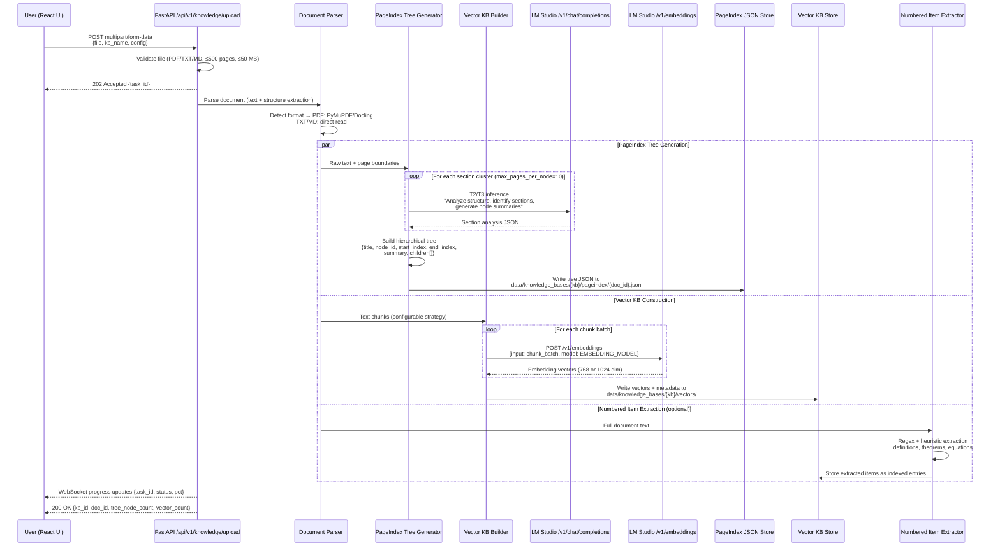
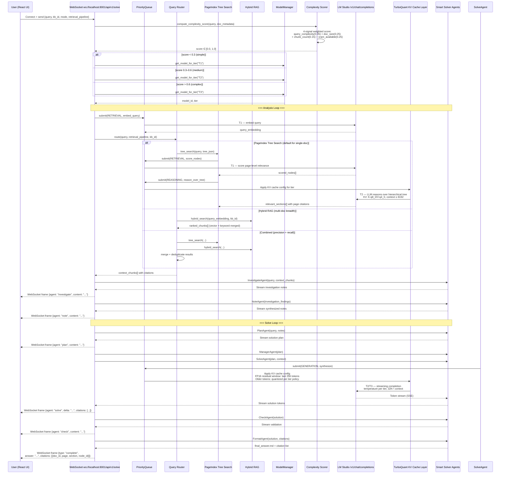
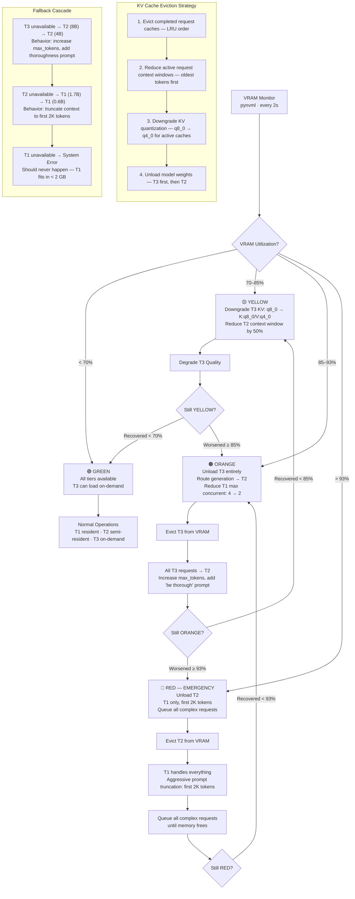

# Unified Document Intelligence Pipeline (UDIP) — Technical Architecture Document

**Version:** 1.0  
**Date:** March 31, 2026  
**Status:** Implementation Blueprint  
**Authoritative Sources:** UDIP-PRD-v1.0.pdf, multi-model-inference-spec.pdf  

---

## Table of Contents

1. [Executive Summary](#1-executive-summary)
2. [System Architecture Diagram](#2-system-architecture-diagram)
3. [Data Flow Diagrams](#3-data-flow-diagrams)
   - 3a. Document Ingestion
   - 3b. Query → Response (Smart Solver)
   - 3c. VRAM Pressure Handling
4. [OpenAPI 3.1 YAML Specification](#4-openapi-31-yaml-specification)
5. [LM Studio Integration Layer Specification](#5-lm-studio-integration-layer-specification)
6. [Component Interaction Matrix](#6-component-interaction-matrix)
7. [Architectural Trade-off Register](#7-architectural-trade-off-register)
8. [Assumptions Log](#8-assumptions-log)

---

## 1. Executive Summary

UDIP merges three systems — **DeepTutor** (multi-agent AI tutoring/Q&A), **PageIndex** (vectorless reasoning-based hierarchical document indexing), and **TurboQuant** (3–4 bit KV cache quantization via PolarQuant + QJL) — into a single local-first web application. The application runs entirely on consumer GPU hardware with no cloud dependencies.

**Core Stack:**
- Backend: Python 3.10+ / FastAPI on port 8001
- Frontend: React / Next.js 16+ on port 3782
- Inference: LM Studio (OpenAI-compatible REST API on port 1234)
- Storage: Local filesystem (`data/` directory)

**Model Tier Architecture:**

| Tier | Role | Models | Quant | VRAM (Weights) | KV Cache (K/V) | Max Concurrent | Latency Target |
|------|------|--------|-------|----------------|----------------|----------------|----------------|
| T1 (Always Resident) | Embedding, retrieval scoring, query classification | Qwen3-0.6B, Qwen3-1.7B | Q4_K_M | 0.5–1.2 GB | K:q4_0 / V:q4_0 | 4 | < 50 ms |
| T2 (Semi-Resident) | Reasoning, chunk re-ranking, query decomposition | Qwen3-4B, Qwen3-8B | Q4–Q5 | 2.5–5.5 GB | K:q8_0 / V:q4_0 | 2 | 100–500 ms |
| T3 (On-Demand) | Final synthesis, multi-hop reasoning | Qwen3-14B, Qwen3-30B-A3B (MoE) | Q4_K_M | 8.5–18 GB | K:q8_0 / V:q8_0 | 1 | 1–5 s |

**Embedding Model (Separate from LLM tiers):**

| Model | Dimensions | MTEB Score | VRAM | Context |
|-------|-----------|------------|------|---------|
| Snowflake Arctic Embed M (GGUF) | 768 | 54.90 NDCG@10 | ~0.5 GB | 512 tokens |
| nomic-embed-text-v1.5 (GGUF) | 768 | 53.25 NDCG@10 | ~0.5 GB | 8192 tokens |
| BGE-M3 | 1024 | 63.0 MTEB | ~1.2 GB | 8192 tokens |

> **Trade-off — Embedding model choice:** Snowflake Arctic Embed M is the safest default (smallest VRAM, verified GGUF). nomic-embed-text offers 16x longer context at minimal quality cost — preferred if documents have long passages. BGE-M3 offers significantly better retrieval quality but costs 2.4x the VRAM. `[ASSUMPTION]` The system defaults to Snowflake Arctic Embed M; the user may override via `EMBEDDING_MODEL` env var.

---

## 2. System Architecture Diagram

```mermaid
graph TB
    subgraph "Frontend — React / Next.js :3782"
        UI[Web UI]
        WS_CLIENT[WebSocket Client]
        DASH[Performance Dashboard]
    end

    subgraph "Backend — Python / FastAPI :8001"
        subgraph "API Layer"
            REST_API[REST API<br>/api/v1/*]
            WS_SOLVE[WebSocket<br>ws://localhost:8001/api/v1/solve]
            WS_METRICS[WebSocket<br>ws://localhost:8001/ws/metrics]
        end

        subgraph "Orchestration Layer"
            PQ[PriorityQueue<br>T1:Sem=4 / T2:Sem=2 / T3:Sem=1]
            MM[ModelManager<br>Tier selection + TTL lifecycle]
            VRAM_MON[VRAM Monitor<br>pynvml · 2s poll<br>GREEN/YELLOW/ORANGE/RED]
            COMPLEXITY[Complexity Scorer<br>4-signal weighted decision]
        end

        subgraph "DeepTutor Agent Suite"
            SMART[Smart Solver<br>Analysis Loop: Investigate + Note<br>Solve Loop: Plan + Manager + Solve + Check + Format]
            DR[Deep Research<br>3-phase: Plan → Research → Report<br>Dynamic Topic Queue · max 5 concurrent]
            GL[Guided Learning<br>Locate → Interactive → Chat → Summary]
            QG[Question Generator<br>Custom + Exam Mimicry]
            IG[IdeaGen<br>Interactive Co-Writer + Automated]
        end

        subgraph "Retrieval Layer"
            PI_SEARCH[PageIndex Tree Search<br>Reasoning-based · page-level citations]
            HYBRID_RAG[Hybrid RAG<br>Vector + keyword retrieval]
            NAIVE_RAG[Naive RAG<br>Pure vector similarity]
            ROUTER[Query Router<br>tree / hybrid / naive / combined]
        end

        subgraph "Document Processing"
            PARSER[Document Parser<br>PDF / TXT / MD · Docling]
            PI_GEN[PageIndex Tree Generator<br>Hierarchical JSON]
            VKB_BUILD[Vector KB Builder<br>Embedding pipeline]
            EXTRACT[Numbered Item Extractor]
        end

        subgraph "KV Cache Layer (TurboQuant)"
            TQ_CONFIG[TurboQuant Config<br>Tier 1: LM Studio native<br>Tier 2: turboquant-server<br>Tier 3: Application-layer]
            KV_POLICY[KV Cache Policy<br>Asymmetric quantization per tier<br>FP16 residual window: 128–256 tokens]
        end

        subgraph "Observability"
            OTEL[OpenTelemetry<br>7 instrumentation points<br>Jaeger export]
            METRICS[MetricsCollector<br>VRAM · Latency · Queue · Throughput]
        end
    end

    subgraph "LM Studio — OpenAI-compatible API :1234"
        LMS_CHAT[POST /v1/chat/completions<br>Streaming SSE]
        LMS_EMBED[POST /v1/embeddings]
        LMS_MODELS[GET /v1/models]
        LMS_LOAD[POST /api/v0/models/load<br>— or lms CLI]
    end

    subgraph "Local Storage — data/"
        PI_STORE["PageIndex JSON Store<br>data/knowledge_bases/{kb}/pageindex/"]
        VEC_STORE["Vector KB Store<br>data/knowledge_bases/{kb}/vectors/"]
        SESSION_STORE["Session Files<br>data/user/solve/solve_YYYYMMDD_HHMMSS/"]
        NOTEBOOK["Notebook Store<br>data/user/notebooks/"]
        KV_CACHE_STORE["KV Cache Metadata<br>data/cache/"]
    end

    %% Frontend ↔ Backend
    UI -->|HTTP REST| REST_API
    WS_CLIENT -->|WebSocket| WS_SOLVE
    DASH -->|WebSocket| WS_METRICS
    DASH -->|HTTP REST| REST_API

    %% API → Orchestration
    REST_API --> PQ
    WS_SOLVE --> SMART
    WS_SOLVE --> DR
    WS_SOLVE --> GL

    %% Orchestration internals
    PQ --> MM
    MM --> VRAM_MON
    MM --> COMPLEXITY
    VRAM_MON --> TQ_CONFIG

    %% Agents → Retrieval
    SMART --> ROUTER
    DR --> ROUTER
    GL --> ROUTER
    QG --> ROUTER
    ROUTER --> PI_SEARCH
    ROUTER --> HYBRID_RAG
    ROUTER --> NAIVE_RAG

    %% Retrieval → LM Studio
    PI_SEARCH -->|T1/T2 inference| LMS_CHAT
    HYBRID_RAG -->|T1 embedding| LMS_EMBED

    %% Document Processing → Storage + LM Studio
    REST_API --> PARSER
    PARSER --> PI_GEN
    PARSER --> VKB_BUILD
    PARSER --> EXTRACT
    PI_GEN -->|T2/T3 inference| LMS_CHAT
    VKB_BUILD -->|Embedding| LMS_EMBED
    PI_GEN --> PI_STORE
    VKB_BUILD --> VEC_STORE

    %% Agent output → Storage
    SMART --> SESSION_STORE
    GL --> NOTEBOOK

    %% Model Manager → LM Studio
    MM -->|Load/Unload| LMS_LOAD
    MM -->|Discovery| LMS_MODELS
    PQ -->|Inference| LMS_CHAT

    %% KV Cache
    TQ_CONFIG --> KV_POLICY
    KV_POLICY -->|Config flags| LMS_CHAT

    %% Observability
    OTEL --> METRICS
    METRICS --> WS_METRICS
```



### Architecture Notes

1. **PriorityQueue** governs all LM Studio calls. Three queue classes — RETRIEVAL (T1, highest priority, Sem=4), REASONING (T2, Sem=2), GENERATION (T3, Sem=1) — ensure retrieval never blocks behind slow generation.

2. **TurboQuant integration** operates at the request layer between FastAPI and LM Studio. Three implementation tiers exist:
   - **Tier 1 (Preferred):** LM Studio native via llama.cpp `--cache-type-k` / `--cache-type-v` flags. `[ASSUMPTION]` LM Studio support for TurboQuant-specific cache types is unconfirmed as of March 2026; the system uses llama.cpp's existing `q4_0`/`q8_0` types today.
   - **Tier 2 (Fallback):** `turboquant-server` (pip install) as an OpenAI-compatible proxy with built-in KV compression.
   - **Tier 3 (Advanced):** Application-layer Python using `TurboQuantCache` with HuggingFace Transformers. Bypasses LM Studio entirely.

3. **Data storage** is entirely local-filesystem. No external vector database server.

---

## 3. Data Flow Diagrams

### 3a. Document Ingestion



**Key constraints from PRD:**
- PageIndex tree generation target: < 60s for 100-page document (NFR-1.1)
- Vector KB creation target: < 120s for 300-page document (NFR-1.2)
- PageIndex tree storage: < 1 MB per 100-page document (NFR-2.4)
- Incremental addition supported: new documents merged without reprocessing existing data (FR-1.4)

> **Trade-off — Chunking strategy for Vector KB:** The PRD supports two RAG pipelines: DeepTutor's default chunking (sentence-window or recursive character) and Docling's structure-aware parsing. Sentence-window chunking preserves surrounding context at the cost of redundant embedding storage (~1.3x). Recursive character chunking is simpler but can split semantic units. Docling handles tables and figures better but adds a dependency. The architecture supports all three via `rag_pipeline` config field; the default is recursive character with 512-token chunks and 64-token overlap. `[ASSUMPTION]` Chunk size and overlap are configurable via environment variables but no env vars are specified in the PRD for these — they are set in the KB creation config.

### 3b. Query → Response (Smart Solver Pipeline)



**Performance targets from PRD:**
- TTFT (Time to First Token): < 3s (NFR-1.3)
- Token generation: ≥ 15 tok/s at 8K+ context (NFR-1.5)
- WebSocket streaming latency: < 100ms agent-to-frontend (NFR-1.6)
- RAGAS Faithfulness: ≥ 0.85 (C1 benchmark)
- Retrieval Precision@5: ≥ 90% (C3 benchmark)

**TurboQuant behavior per LLM request:**
1. **Prefill phase:** Process entire input prompt, compute K/V vectors. TurboQuant does NOT accelerate this phase.
2. **Post-prefill quantization:** Older tokens quantized (PolarQuant rotation → scalar quantization at b-1 bits → QJL 1-bit residual). Most recent 128–256 tokens remain FP16.
3. **Decode phase (per token):** Load compressed KV from HBM to SRAM (4x less data). Dequantize on-the-fly. Compute unbiased attention scores (QJL correction). Append new token's K/V to compressed cache.
4. **Net effect:** Each decode step reads ~4x less memory bandwidth. On an 8B model with 16 GB GPU, max context extends from ~16K tokens (FP16) to ~48K–64K tokens (4-bit TurboQuant).

### 3c. VRAM Pressure Handling



> **Trade-off — Cache eviction policy:** LRU eviction is simplest to implement but may evict a cache that will be needed in 100ms by a second agent step in the same query pipeline. An alternative is per-query-session pinning, where all caches belonging to an active query session are protected until the session completes. The trade-off is that pinning can cause VRAM fragmentation under burst load. This architecture defaults to LRU with session-pinning for active Smart Solver sessions (up to 2 pinned sessions). `[ASSUMPTION]` LM Studio manages its own internal KV cache lifecycle; this eviction logic applies only when UDIP controls the cache via Tier 2/3 TurboQuant integration.

---

## 4. OpenAPI 3.1 YAML Specification

```yaml
openapi: "3.1.0"
info:
  title: UDIP — Unified Document Intelligence Pipeline API
  version: "1.0.0"
  description: |
    Local-first document intelligence API combining DeepTutor multi-agent Q&A,
    PageIndex reasoning-based retrieval, and TurboQuant KV cache optimization.
    All endpoints served by FastAPI on localhost:8001.
  contact:
    name: UDIP Development
  license:
    name: MIT

servers:
  - url: http://localhost:8001
    description: Local FastAPI backend

tags:
  - name: Knowledge Base
    description: Document upload, KB management, and indexing
  - name: Query
    description: Question answering and agent interactions
  - name: Retrieval
    description: Direct retrieval operations
  - name: Models
    description: Model tier management and status
  - name: Cache
    description: KV cache status and control
  - name: VRAM
    description: GPU memory monitoring
  - name: Metrics
    description: Performance metrics and benchmarking
  - name: System
    description: Health checks and configuration

paths:
  # ─────────────────────────── Knowledge Base ───────────────────────────

  /api/v1/knowledge/upload:
    post:
      operationId: uploadDocument
      tags: [Knowledge Base]
      summary: Upload a document to create or extend a knowledge base
      description: |
        Accepts PDF, TXT, or Markdown files. Triggers parallel processing:
        PageIndex tree generation and vector KB construction. Returns immediately
        with a task_id for progress tracking. Max file size: 50 MB, max pages: 500.
      requestBody:
        required: true
        content:
          multipart/form-data:
            schema:
              type: object
              required: [file, kb_name]
              properties:
                file:
                  type: string
                  format: binary
                  description: Document file (PDF, TXT, or MD)
                kb_name:
                  type: string
                  minLength: 1
                  maxLength: 128
                  pattern: "^[a-zA-Z0-9_-]+$"
                  description: Knowledge base identifier
                  example: "immigration_law_2026"
                rag_pipeline:
                  type: string
                  enum: [default, docling]
                  default: default
                  description: RAG processing pipeline
                pageindex_config:
                  type: object
                  properties:
                    model:
                      type: string
                      description: Model for tree generation (overrides PAGEINDEX_MODEL)
                      example: "qwen3-8b-q5_k_m"
                    toc_check_pages:
                      type: integer
                      minimum: 1
                      maximum: 20
                      default: 5
                      description: Pages to scan for table of contents
                    max_pages_per_node:
                      type: integer
                      minimum: 1
                      maximum: 50
                      default: 10
                    max_tokens_per_node:
                      type: integer
                      minimum: 1000
                      maximum: 100000
                      default: 20000
                embedding_config:
                  type: object
                  properties:
                    model:
                      type: string
                      description: Embedding model (overrides EMBEDDING_MODEL)
                      example: "snowflake-arctic-embed-m-gguf"
                    chunk_size:
                      type: integer
                      minimum: 64
                      maximum: 4096
                      default: 512
                    chunk_overlap:
                      type: integer
                      minimum: 0
                      maximum: 512
                      default: 64
      responses:
        "202":
          description: Upload accepted, processing started
          content:
            application/json:
              schema:
                $ref: "#/components/schemas/UploadAccepted"
              example:
                task_id: "task_20260331_143022_abc123"
                kb_name: "immigration_law_2026"
                doc_id: "doc_irpa_sections"
                status: "processing"
                estimated_duration_s: 45
        "400":
          description: Invalid file type, size, or parameters
          content:
            application/json:
              schema:
                $ref: "#/components/schemas/ErrorResponse"
              example:
                error: "validation_error"
                message: "File exceeds 50 MB limit (actual: 67.2 MB)"
                details:
                  field: "file"
                  constraint: "max_size_bytes"
                  limit: 52428800
        "422":
          description: Unprocessable content
          content:
            application/json:
              schema:
                $ref: "#/components/schemas/ErrorResponse"

  /api/v1/knowledge/tasks/{task_id}:
    get:
      operationId: getTaskStatus
      tags: [Knowledge Base]
      summary: Get document processing task status
      parameters:
        - name: task_id
          in: path
          required: true
          schema:
            type: string
          example: "task_20260331_143022_abc123"
      responses:
        "200":
          description: Task status
          content:
            application/json:
              schema:
                $ref: "#/components/schemas/TaskStatus"
              example:
                task_id: "task_20260331_143022_abc123"
                status: "completed"
                progress_pct: 100
                result:
                  kb_id: "immigration_law_2026"
                  doc_id: "doc_irpa_sections"
                  tree_node_count: 47
                  vector_count: 312
                  pages_processed: 85
                  processing_time_s: 38.7
        "404":
          description: Task not found
          content:
            application/json:
              schema:
                $ref: "#/components/schemas/ErrorResponse"

  /api/v1/knowledge/bases:
    get:
      operationId: listKnowledgeBases
      tags: [Knowledge Base]
      summary: List all knowledge bases
      responses:
        "200":
          description: List of knowledge bases
          content:
            application/json:
              schema:
                type: object
                properties:
                  knowledge_bases:
                    type: array
                    items:
                      $ref: "#/components/schemas/KnowledgeBaseSummary"

  /api/v1/knowledge/bases/{kb_name}:
    get:
      operationId: getKnowledgeBase
      tags: [Knowledge Base]
      summary: Get knowledge base details
      parameters:
        - name: kb_name
          in: path
          required: true
          schema:
            type: string
      responses:
        "200":
          description: Knowledge base details
          content:
            application/json:
              schema:
                $ref: "#/components/schemas/KnowledgeBaseDetail"
    delete:
      operationId: deleteKnowledgeBase
      tags: [Knowledge Base]
      summary: Delete a knowledge base and all associated data
      parameters:
        - name: kb_name
          in: path
          required: true
          schema:
            type: string
      responses:
        "204":
          description: Deleted successfully
        "404":
          description: Knowledge base not found

  /api/v1/knowledge/bases/{kb_name}/documents/{doc_id}:
    delete:
      operationId: deleteDocument
      tags: [Knowledge Base]
      summary: Remove a single document from a knowledge base
      parameters:
        - name: kb_name
          in: path
          required: true
          schema:
            type: string
        - name: doc_id
          in: path
          required: true
          schema:
            type: string
      responses:
        "204":
          description: Document removed
        "404":
          description: Document not found

  /api/v1/knowledge/bases/{kb_name}/pageindex/{doc_id}:
    get:
      operationId: getPageIndexTree
      tags: [Knowledge Base]
      summary: Retrieve the PageIndex hierarchical tree for a document
      parameters:
        - name: kb_name
          in: path
          required: true
          schema:
            type: string
        - name: doc_id
          in: path
          required: true
          schema:
            type: string
      responses:
        "200":
          description: PageIndex tree JSON
          content:
            application/json:
              schema:
                $ref: "#/components/schemas/PageIndexTree"

  # ─────────────────────────── Retrieval ───────────────────────────

  /api/v1/retrieve:
    post:
      operationId: retrieve
      tags: [Retrieval]
      summary: Execute a retrieval query against a knowledge base
      description: |
        Performs retrieval using the specified pipeline (tree, hybrid, naive, combined).
        Returns ranked results with page-level citations.
      requestBody:
        required: true
        content:
          application/json:
            schema:
              type: object
              required: [query, kb_name]
              properties:
                query:
                  type: string
                  minLength: 1
                  maxLength: 4096
                  example: "What is the fee for a work permit extension?"
                kb_name:
                  type: string
                  example: "immigration_law_2026"
                doc_id:
                  type: string
                  nullable: true
                  description: Optional — restrict to single document
                pipeline:
                  type: string
                  enum: [tree, hybrid, naive, combined]
                  default: tree
                  description: Retrieval pipeline selection
                top_k:
                  type: integer
                  minimum: 1
                  maximum: 50
                  default: 5
                min_relevance_score:
                  type: number
                  format: float
                  minimum: 0.0
                  maximum: 1.0
                  default: 0.3
      responses:
        "200":
          description: Retrieval results with citations
          content:
            application/json:
              schema:
                $ref: "#/components/schemas/RetrievalResponse"
              example:
                query: "What is the fee for a work permit extension?"
                pipeline_used: "tree"
                results:
                  - rank: 1
                    relevance_score: 0.94
                    content: "The prescribed fee for a work permit extension is $155 CAD..."
                    citation:
                      doc_id: "doc_irpa_fees"
                      page: 12
                      section: "Schedule II — Fees"
                      node_id: "node_3_2_1"
                      start_index: 4521
                      end_index: 4789
                  - rank: 2
                    relevance_score: 0.87
                    content: "Open work permit holders are exempt from..."
                    citation:
                      doc_id: "doc_irpa_fees"
                      page: 14
                      section: "Fee Exemptions"
                      node_id: "node_3_3"
                      start_index: 5102
                      end_index: 5340
                retrieval_latency_ms: 342
                model_tier_used: "T1"
                total_candidates_scored: 47

  # ─────────────────────────── Query (WebSocket) ───────────────────────────
  # Note: WebSocket endpoints cannot be fully expressed in OpenAPI.
  # The following documents the message protocol.

  /api/v1/solve:
    get:
      operationId: solveWebSocket
      tags: [Query]
      summary: "WebSocket: Smart Solver multi-agent Q&A"
      description: |
        **WebSocket endpoint at ws://localhost:8001/api/v1/solve**

        Client sends a JSON message to initiate solving. Server streams
        agent reasoning steps as JSON frames. Connection stays open for
        the duration of the solving session.

        **Client → Server message:**
        ```json
        {
          "query": "Compare the LMIA requirements for high-wage and low-wage positions",
          "kb_name": "immigration_law_2026",
          "mode": "auto",
          "retrieval_pipeline": "combined",
          "session_id": "session_abc123"
        }
        ```

        **Server → Client frames:**
        ```json
        {"type": "agent_step", "agent": "investigate", "content": "Searching PageIndex tree...", "timestamp": 1711900000}
        {"type": "agent_step", "agent": "note", "content": "Found 3 relevant sections...", "timestamp": 1711900002}
        {"type": "agent_step", "agent": "plan", "content": "Will compare: 1) wage threshold...", "timestamp": 1711900004}
        {"type": "agent_step", "agent": "solve", "delta": "The key differences between...", "timestamp": 1711900006}
        {"type": "citation", "citation": {"doc_id": "doc_lmia", "page": 7, "section": "High-Wage Stream", "node_id": "node_2_1"}}
        {"type": "complete", "answer": "...", "citations": [...], "session_id": "session_abc123", "solve_dir": "data/user/solve/solve_20260331_143022/"}
        {"type": "error", "error": "inference_timeout", "message": "T3 model timed out after 120s"}
        ```

        **Mode options:** `auto` (system selects), `detailed` (forces T3, longer output), `quick` (T1/T2 only, fast path)
      parameters:
        - name: Upgrade
          in: header
          required: true
          schema:
            type: string
            const: websocket
      responses:
        "101":
          description: WebSocket upgrade successful

  /api/v1/query:
    post:
      operationId: queryHTTP
      tags: [Query]
      summary: "HTTP fallback: synchronous query (non-streaming)"
      description: |
        For clients that cannot use WebSocket. Returns complete answer
        after all agent steps finish. Supports SSE streaming via Accept header.
      requestBody:
        required: true
        content:
          application/json:
            schema:
              $ref: "#/components/schemas/QueryRequest"
      responses:
        "200":
          description: Complete answer with citations
          content:
            application/json:
              schema:
                $ref: "#/components/schemas/QueryResponse"

  # ─────────────────────────── Deep Research ───────────────────────────

  /api/v1/research:
    post:
      operationId: startDeepResearch
      tags: [Query]
      summary: Start a Deep Research session
      description: |
        Three-phase pipeline: Planning (Rephrase + Decompose), Researching
        (Manager + Research + Note agents, max 5 concurrent topics), Reporting.
        Returns task_id for progress tracking via WebSocket.
      requestBody:
        required: true
        content:
          application/json:
            schema:
              type: object
              required: [query, kb_name]
              properties:
                query:
                  type: string
                  example: "Analyze all pathways for Canadian PR through Provincial Nominee Programs"
                kb_name:
                  type: string
                execution_mode:
                  type: string
                  enum: [parallel, series]
                  default: parallel
                max_concurrent_topics:
                  type: integer
                  minimum: 1
                  maximum: 10
                  default: 5
                enable_web_search:
                  type: boolean
                  default: false
                  description: Opt-in web search (requires internet, SEARCH_API_KEY)
                enable_paper_search:
                  type: boolean
                  default: false
      responses:
        "202":
          description: Research session started
          content:
            application/json:
              schema:
                type: object
                properties:
                  task_id:
                    type: string
                  session_id:
                    type: string
                  topic_count:
                    type: integer

  # ─────────────────────────── Question Generation ───────────────────────────

  /api/v1/questions/generate:
    post:
      operationId: generateQuestions
      tags: [Query]
      summary: Generate practice questions from knowledge base
      requestBody:
        required: true
        content:
          application/json:
            schema:
              type: object
              required: [kb_name]
              properties:
                kb_name:
                  type: string
                count:
                  type: integer
                  minimum: 1
                  maximum: 50
                  default: 10
                difficulty:
                  type: string
                  enum: [easy, medium, hard, mixed]
                  default: mixed
                question_types:
                  type: array
                  items:
                    type: string
                    enum: [multiple_choice, short_answer, essay, true_false]
                  default: [multiple_choice, short_answer]
                reference_exam_file:
                  type: string
                  format: binary
                  nullable: true
                  description: Upload a reference exam for mimicry mode
      responses:
        "200":
          description: Generated questions
          content:
            application/json:
              schema:
                $ref: "#/components/schemas/GeneratedQuestions"

  # ─────────────────────────── Guided Learning ───────────────────────────

  /api/v1/learning/start:
    post:
      operationId: startGuidedLearning
      tags: [Query]
      summary: Start a guided learning session
      requestBody:
        required: true
        content:
          application/json:
            schema:
              type: object
              required: [kb_name, topic]
              properties:
                kb_name:
                  type: string
                topic:
                  type: string
                  example: "LMIA application process"
                knowledge_points:
                  type: integer
                  minimum: 3
                  maximum: 10
                  default: 5
      responses:
        "200":
          description: Learning session started
          content:
            application/json:
              schema:
                type: object
                properties:
                  session_id:
                    type: string
                  learning_plan:
                    type: array
                    items:
                      type: object
                      properties:
                        point_id:
                          type: string
                        title:
                          type: string
                        description:
                          type: string

  # ─────────────────────────── Models ───────────────────────────

  /api/v1/models:
    get:
      operationId: listModels
      tags: [Models]
      summary: List all available and loaded models with tier assignments
      responses:
        "200":
          description: Model status list
          content:
            application/json:
              schema:
                type: object
                properties:
                  models:
                    type: array
                    items:
                      $ref: "#/components/schemas/ModelStatus"
              example:
                models:
                  - model_id: "qwen3-1.7b-q4_k_m"
                    tier: "T1"
                    status: "loaded"
                    vram_mb: 1150
                    active_requests: 2
                    avg_tok_per_sec: 89.3
                    kv_cache_type_k: "q4_0"
                    kv_cache_type_v: "q4_0"
                    context_length: 4096
                    ttl_seconds: null
                  - model_id: "qwen3-8b-q5_k_m"
                    tier: "T2"
                    status: "loaded"
                    vram_mb: 5200
                    active_requests: 0
                    avg_tok_per_sec: 34.1
                    kv_cache_type_k: "q8_0"
                    kv_cache_type_v: "q4_0"
                    context_length: 8192
                    ttl_seconds: 600
                  - model_id: "qwen3-30b-a3b-q4_k_m"
                    tier: "T3"
                    status: "unloaded"
                    vram_mb: 0
                    active_requests: 0
                    avg_tok_per_sec: 0
                    kv_cache_type_k: "q8_0"
                    kv_cache_type_v: "q8_0"
                    context_length: 16384
                    ttl_seconds: 300

  /api/v1/models/{model_id}/load:
    post:
      operationId: loadModel
      tags: [Models]
      summary: Manually load a model into VRAM
      parameters:
        - name: model_id
          in: path
          required: true
          schema:
            type: string
          example: "qwen3-14b-q4_k_m"
      requestBody:
        content:
          application/json:
            schema:
              type: object
              properties:
                context_length:
                  type: integer
                  default: 8192
                gpu_offload:
                  type: string
                  enum: [max, auto, none]
                  default: max
      responses:
        "200":
          description: Model loaded
          content:
            application/json:
              schema:
                $ref: "#/components/schemas/ModelStatus"
        "507":
          description: Insufficient VRAM
          content:
            application/json:
              schema:
                $ref: "#/components/schemas/ErrorResponse"
              example:
                error: "insufficient_vram"
                message: "Model requires ~8.5 GB but only 3.2 GB free"
                details:
                  required_mb: 8500
                  available_mb: 3200

  /api/v1/models/{model_id}/unload:
    post:
      operationId: unloadModel
      tags: [Models]
      summary: Unload a model from VRAM
      parameters:
        - name: model_id
          in: path
          required: true
          schema:
            type: string
      responses:
        "200":
          description: Model unloaded
        "409":
          description: Model has active requests
          content:
            application/json:
              schema:
                $ref: "#/components/schemas/ErrorResponse"

  # ─────────────────────────── Cache ───────────────────────────

  /api/v1/cache/status:
    get:
      operationId: getCacheStatus
      tags: [Cache]
      summary: Get KV cache status across all loaded models
      responses:
        "200":
          description: Cache status
          content:
            application/json:
              schema:
                $ref: "#/components/schemas/CacheStatus"
              example:
                turboquant_enabled: true
                turboquant_bits: 4
                residual_window_tokens: 256
                integration_tier: 1
                total_kv_cache_mb: 342.5
                compression_ratio: 3.8
                per_model:
                  - model_id: "qwen3-8b-q5_k_m"
                    kv_type_k: "q8_0"
                    kv_type_v: "q4_0"
                    context_used: 4096
                    context_max: 8192
                    kv_size_mb: 312.0
                    kv_size_fp16_equivalent_mb: 1185.6

  /api/v1/cache/config:
    put:
      operationId: updateCacheConfig
      tags: [Cache]
      summary: Update KV cache quantization configuration
      requestBody:
        required: true
        content:
          application/json:
            schema:
              type: object
              properties:
                turboquant_enabled:
                  type: boolean
                turboquant_bits:
                  type: integer
                  enum: [3, 4]
                residual_window_tokens:
                  type: integer
                  minimum: 64
                  maximum: 512
                  default: 256
      responses:
        "200":
          description: Configuration updated
          content:
            application/json:
              schema:
                $ref: "#/components/schemas/CacheStatus"

  /api/v1/cache/evict:
    post:
      operationId: evictCache
      tags: [Cache]
      summary: Manually trigger KV cache eviction
      description: Evicts completed request caches in LRU order
      responses:
        "200":
          description: Eviction result
          content:
            application/json:
              schema:
                type: object
                properties:
                  evicted_entries:
                    type: integer
                  freed_mb:
                    type: number
                    format: float

  # ─────────────────────────── VRAM ───────────────────────────

  /api/v1/vram/status:
    get:
      operationId: getVRAMStatus
      tags: [VRAM]
      summary: Get current GPU VRAM status and pressure level
      responses:
        "200":
          description: VRAM status
          content:
            application/json:
              schema:
                $ref: "#/components/schemas/VRAMStatus"
              example:
                total_mb: 24576
                used_mb: 15360
                free_mb: 9216
                utilization_pct: 62.5
                pressure_level: "GREEN"
                breakdown:
                  model_weights_mb: 6700
                  kv_cache_mb: 342
                  system_overhead_mb: 8318
                  free_mb: 9216

  # ─────────────────────────── Metrics ───────────────────────────

  /api/v1/metrics/history:
    get:
      operationId: getMetricsHistory
      tags: [Metrics]
      summary: Get historical metrics timeseries
      parameters:
        - name: window
          in: query
          schema:
            type: integer
            default: 3600
          description: Lookback window in seconds
        - name: resolution
          in: query
          schema:
            type: integer
            default: 10
          description: Data point interval in seconds
      responses:
        "200":
          description: Timeseries data
          content:
            application/json:
              schema:
                type: object
                properties:
                  data:
                    type: array
                    items:
                      $ref: "#/components/schemas/TimeseriesPoint"

  /api/v1/metrics/models:
    get:
      operationId: getModelMetrics
      tags: [Metrics]
      summary: Get detailed model performance metrics
      responses:
        "200":
          description: Model metrics
          content:
            application/json:
              schema:
                type: object
                properties:
                  models:
                    type: array
                    items:
                      $ref: "#/components/schemas/ModelStatus"

  /api/v1/metrics/benchmarks/latest:
    get:
      operationId: getLatestBenchmarks
      tags: [Metrics]
      summary: Get results from the most recent benchmark run
      responses:
        "200":
          description: Benchmark results
          content:
            application/json:
              schema:
                type: object
                properties:
                  run_id:
                    type: string
                  completed_at:
                    type: string
                    format: date-time
                  results:
                    type: array
                    items:
                      $ref: "#/components/schemas/BenchmarkResult"

  /api/v1/metrics/benchmarks/run:
    post:
      operationId: runBenchmarks
      tags: [Metrics]
      summary: Trigger a full benchmark suite run
      description: |
        Runs test categories A (latency), B (KV cache efficiency),
        C (answer quality/RAGAS), D (throughput). Returns immediately
        with a run_id for polling.
      responses:
        "202":
          description: Benchmark started
          content:
            application/json:
              schema:
                type: object
                properties:
                  run_id:
                    type: string
                    example: "bench_20260331_150000"

  /api/v1/metrics/benchmarks/{run_id}:
    get:
      operationId: getBenchmarkRun
      tags: [Metrics]
      summary: Get status and results of a specific benchmark run
      parameters:
        - name: run_id
          in: path
          required: true
          schema:
            type: string
      responses:
        "200":
          description: Benchmark run status
          content:
            application/json:
              schema:
                type: object
                properties:
                  run_id:
                    type: string
                  status:
                    type: string
                    enum: [running, completed, failed]
                  progress_pct:
                    type: integer
                  results:
                    type: array
                    items:
                      $ref: "#/components/schemas/BenchmarkResult"

  # ─────────────────────────── System ───────────────────────────

  /api/v1/health:
    get:
      operationId: healthCheck
      tags: [System]
      summary: System health check
      description: |
        Verifies LM Studio connectivity, model availability, GPU access,
        and TurboQuant integration tier. Called at startup and available
        for monitoring.
      responses:
        "200":
          description: System healthy
          content:
            application/json:
              schema:
                $ref: "#/components/schemas/HealthStatus"
              example:
                status: "healthy"
                lm_studio:
                  connected: true
                  base_url: "http://localhost:1234"
                  models_available: 5
                gpu:
                  detected: true
                  name: "NVIDIA RTX 4090"
                  vram_total_mb: 24576
                  driver_version: "560.35.03"
                turboquant:
                  enabled: true
                  integration_tier: 1
                  bits: 4
                  residual_window: 256
                version: "1.0.0"
                uptime_s: 3842

  /api/v1/config:
    get:
      operationId: getConfig
      tags: [System]
      summary: Get current system configuration
      responses:
        "200":
          description: System configuration
          content:
            application/json:
              schema:
                $ref: "#/components/schemas/SystemConfig"
    put:
      operationId: updateConfig
      tags: [System]
      summary: Update system configuration at runtime
      requestBody:
        required: true
        content:
          application/json:
            schema:
              $ref: "#/components/schemas/SystemConfigUpdate"
      responses:
        "200":
          description: Configuration updated
          content:
            application/json:
              schema:
                $ref: "#/components/schemas/SystemConfig"

# ─────────────────────────────────────────────────────────────────────────
# COMPONENTS
# ─────────────────────────────────────────────────────────────────────────

components:
  schemas:
    UploadAccepted:
      type: object
      required: [task_id, kb_name, doc_id, status]
      properties:
        task_id:
          type: string
        kb_name:
          type: string
        doc_id:
          type: string
        status:
          type: string
          enum: [processing, queued]
        estimated_duration_s:
          type: number
          format: float

    TaskStatus:
      type: object
      required: [task_id, status, progress_pct]
      properties:
        task_id:
          type: string
        status:
          type: string
          enum: [queued, processing, completed, failed]
        progress_pct:
          type: integer
          minimum: 0
          maximum: 100
        error:
          type: string
          nullable: true
        result:
          type: object
          nullable: true
          properties:
            kb_id:
              type: string
            doc_id:
              type: string
            tree_node_count:
              type: integer
            vector_count:
              type: integer
            pages_processed:
              type: integer
            processing_time_s:
              type: number
              format: float

    KnowledgeBaseSummary:
      type: object
      properties:
        kb_name:
          type: string
        document_count:
          type: integer
        total_pages:
          type: integer
        total_vectors:
          type: integer
        total_tree_nodes:
          type: integer
        created_at:
          type: string
          format: date-time
        last_updated:
          type: string
          format: date-time

    KnowledgeBaseDetail:
      type: object
      properties:
        kb_name:
          type: string
        documents:
          type: array
          items:
            type: object
            properties:
              doc_id:
                type: string
              filename:
                type: string
              pages:
                type: integer
              tree_node_count:
                type: integer
              vector_count:
                type: integer
              uploaded_at:
                type: string
                format: date-time
        config:
          type: object
          properties:
            embedding_model:
              type: string
            chunk_size:
              type: integer
            chunk_overlap:
              type: integer
            pageindex_model:
              type: string

    PageIndexTree:
      type: object
      description: Hierarchical document index tree
      required: [doc_id, root]
      properties:
        doc_id:
          type: string
        title:
          type: string
        total_pages:
          type: integer
        root:
          $ref: "#/components/schemas/PageIndexNode"

    PageIndexNode:
      type: object
      required: [node_id, title, start_index, end_index]
      properties:
        node_id:
          type: string
          description: Unique node identifier in format "node_{depth}_{index}"
          example: "node_1_0"
        title:
          type: string
          example: "Chapter 3: Work Permits"
        summary:
          type: string
          description: LLM-generated summary of this section
        start_index:
          type: integer
          description: Start character position in source document
        end_index:
          type: integer
          description: End character position in source document
        page_start:
          type: integer
        page_end:
          type: integer
        children:
          type: array
          items:
            $ref: "#/components/schemas/PageIndexNode"

    Citation:
      type: object
      required: [doc_id, page, node_id]
      properties:
        citation_id:
          type: string
          description: Deduplicated ID from CitationManager
          example: "cite_001"
        doc_id:
          type: string
          example: "doc_irpa_fees"
        page:
          type: integer
          example: 12
        section:
          type: string
          example: "Schedule II — Fees"
        node_id:
          type: string
          example: "node_3_2_1"
        start_index:
          type: integer
        end_index:
          type: integer
        content_preview:
          type: string
          maxLength: 200
          description: First 200 chars of the cited passage

    RetrievalResponse:
      type: object
      properties:
        query:
          type: string
        pipeline_used:
          type: string
          enum: [tree, hybrid, naive, combined]
        results:
          type: array
          items:
            type: object
            properties:
              rank:
                type: integer
              relevance_score:
                type: number
                format: float
              content:
                type: string
              citation:
                $ref: "#/components/schemas/Citation"
        retrieval_latency_ms:
          type: number
          format: float
        model_tier_used:
          type: string
        total_candidates_scored:
          type: integer

    QueryRequest:
      type: object
      required: [query, kb_name]
      properties:
        query:
          type: string
          minLength: 1
          maxLength: 4096
        kb_name:
          type: string
        mode:
          type: string
          enum: [auto, detailed, quick]
          default: auto
        retrieval_pipeline:
          type: string
          enum: [tree, hybrid, naive, combined]
          default: tree
        session_id:
          type: string
          nullable: true

    QueryResponse:
      type: object
      properties:
        answer:
          type: string
        citations:
          type: array
          items:
            $ref: "#/components/schemas/Citation"
        agent_steps:
          type: array
          items:
            type: object
            properties:
              agent:
                type: string
                enum: [investigate, note, plan, manager, solve, check, format]
              content:
                type: string
              timestamp:
                type: string
                format: date-time
        model_tier_used:
          type: string
        complexity_score:
          type: number
          format: float
        e2e_latency_ms:
          type: number
          format: float
        session_id:
          type: string
        solve_dir:
          type: string
          description: Local path to saved session artifacts

    GeneratedQuestions:
      type: object
      properties:
        questions:
          type: array
          items:
            type: object
            properties:
              id:
                type: string
              type:
                type: string
                enum: [multiple_choice, short_answer, essay, true_false]
              difficulty:
                type: string
                enum: [easy, medium, hard]
              question:
                type: string
              options:
                type: array
                items:
                  type: string
                nullable: true
              answer:
                type: string
              explanation:
                type: string
              source_citation:
                $ref: "#/components/schemas/Citation"

    ModelStatus:
      type: object
      properties:
        model_id:
          type: string
        tier:
          type: string
          enum: [T1, T2, T3, embedding]
        status:
          type: string
          enum: [loaded, unloaded, loading, error]
        vram_mb:
          type: number
          format: float
        active_requests:
          type: integer
        avg_tok_per_sec:
          type: number
          format: float
        tokens_generated_total:
          type: integer
        kv_cache_type_k:
          type: string
        kv_cache_type_v:
          type: string
        context_length:
          type: integer
        ttl_seconds:
          type: integer
          nullable: true
          description: "null = always resident (T1)"

    CacheStatus:
      type: object
      properties:
        turboquant_enabled:
          type: boolean
        turboquant_bits:
          type: integer
        residual_window_tokens:
          type: integer
        integration_tier:
          type: integer
          enum: [1, 2, 3]
        total_kv_cache_mb:
          type: number
          format: float
        compression_ratio:
          type: number
          format: float
          description: "Ratio vs FP16 baseline"
        per_model:
          type: array
          items:
            type: object
            properties:
              model_id:
                type: string
              kv_type_k:
                type: string
              kv_type_v:
                type: string
              context_used:
                type: integer
              context_max:
                type: integer
              kv_size_mb:
                type: number
                format: float
              kv_size_fp16_equivalent_mb:
                type: number
                format: float

    VRAMStatus:
      type: object
      properties:
        total_mb:
          type: number
          format: float
        used_mb:
          type: number
          format: float
        free_mb:
          type: number
          format: float
        utilization_pct:
          type: number
          format: float
        pressure_level:
          type: string
          enum: [GREEN, YELLOW, ORANGE, RED]
        breakdown:
          type: object
          properties:
            model_weights_mb:
              type: number
              format: float
            kv_cache_mb:
              type: number
              format: float
            system_overhead_mb:
              type: number
              format: float
            free_mb:
              type: number
              format: float

    TimeseriesPoint:
      type: object
      properties:
        timestamp:
          type: integer
          description: Unix epoch milliseconds
        ttft_ms:
          type: number
          format: float
        e2e_ms:
          type: number
          format: float
        retrieval_ms:
          type: number
          format: float
        p95_e2e_ms:
          type: number
          format: float
        vram_utilization_pct:
          type: number
          format: float
        throughput_tok_per_sec:
          type: number
          format: float

    BenchmarkResult:
      type: object
      properties:
        test_id:
          type: string
          example: "A1"
        category:
          type: string
          enum: [latency, kv_cache, quality, throughput]
        test_case:
          type: string
        metric:
          type: string
        value:
          type: number
          format: float
        threshold:
          type: number
          format: float
        passed:
          type: boolean

    HealthStatus:
      type: object
      properties:
        status:
          type: string
          enum: [healthy, degraded, unhealthy]
        lm_studio:
          type: object
          properties:
            connected:
              type: boolean
            base_url:
              type: string
            models_available:
              type: integer
        gpu:
          type: object
          properties:
            detected:
              type: boolean
            name:
              type: string
            vram_total_mb:
              type: number
              format: float
            driver_version:
              type: string
        turboquant:
          type: object
          properties:
            enabled:
              type: boolean
            integration_tier:
              type: integer
            bits:
              type: integer
            residual_window:
              type: integer
        version:
          type: string
        uptime_s:
          type: number
          format: float

    SystemConfig:
      type: object
      properties:
        llm_model:
          type: string
        llm_host:
          type: string
        embedding_model:
          type: string
        embedding_host:
          type: string
        backend_port:
          type: integer
        frontend_port:
          type: integer
        turboquant_enabled:
          type: boolean
        turboquant_bits:
          type: integer
        turboquant_residual_window:
          type: integer
        turboquant_tier:
          type: string
        pageindex_model:
          type: string
        pageindex_max_pages_per_node:
          type: integer
        pageindex_max_tokens_per_node:
          type: integer
        search_provider:
          type: string
          nullable: true

    SystemConfigUpdate:
      type: object
      description: All fields optional — only provided fields are updated
      properties:
        turboquant_enabled:
          type: boolean
        turboquant_bits:
          type: integer
          enum: [3, 4]
        turboquant_residual_window:
          type: integer
        pageindex_max_pages_per_node:
          type: integer
        pageindex_max_tokens_per_node:
          type: integer

    ErrorResponse:
      type: object
      required: [error, message]
      properties:
        error:
          type: string
          description: Machine-readable error code
          example: "validation_error"
        message:
          type: string
          description: Human-readable description
        details:
          type: object
          nullable: true
          additionalProperties: true
```

### OpenTelemetry Observability Hooks

The 7 instrumentation points from the multi-model inference spec are mapped to OpenAPI endpoints:

| Point | Span Name | Attached To | Attributes |
|-------|-----------|-------------|------------|
| 1 | `http.request` | All REST endpoints (middleware) | `path`, `model_tier`, `e2e_latency_ms` |
| 2 | `pageindex.retrieve` | `/api/v1/retrieve`, WebSocket solve | `retrieval.latency_ms`, `retrieval.chunks_returned` |
| 3 | `pageindex.embed_query` | Nested within Point 2 | Embedding model, dimension count |
| 4 | `pageindex.vector_search` | Nested within Point 2 | Candidate count, threshold |
| 5 | `deeptutor.reason` | WebSocket solve agents | `reasoning.model_tier`, `reasoning.input_tokens` |
| 6 | `lmstudio.inference` | All LM Studio calls | `inference.ttft_ms`, `inference.total_tokens`, `inference.model` |
| 7 | `vram.monitor` | Background task (2s poll) | `vram_utilization_pct`, `vram_free_mb`, `memory_pressure_level` |

---

## 5. LM Studio Integration Layer Specification

### 5.1 Base URL Configuration

```python
# Environment-driven configuration
import os

class LMStudioConfig:
    """Configuration for LM Studio connection."""

    # Chat/Completion API
    LLM_HOST: str = os.getenv("LLM_HOST", "http://localhost:1234")
    LLM_API_KEY: str = os.getenv("LLM_API_KEY", "lm-studio")  # [ASSUMPTION] LM Studio default key
    LLM_MODEL: str = os.getenv("LLM_MODEL", "qwen3-8b-q5_k_m")

    # Embedding API (may be same or different LM Studio instance)
    EMBEDDING_HOST: str = os.getenv("EMBEDDING_HOST", "http://localhost:1234")
    EMBEDDING_API_KEY: str = os.getenv("EMBEDDING_API_KEY", "lm-studio")
    EMBEDDING_MODEL: str = os.getenv("EMBEDDING_MODEL", "snowflake-arctic-embed-m-gguf")

    # Internal management API
    # [ASSUMPTION] LM Studio's REST API for programmatic model loading uses /api/v0/models/load.
    # Exact path should be verified against LM Studio version. Alternatives: TypeScript SDK or `lms` CLI.
    MANAGEMENT_BASE: str = f"{LLM_HOST}"
    MODEL_LOAD_ENDPOINT: str = "/api/v0/models/load"
    MODEL_UNLOAD_ENDPOINT: str = "/api/v0/models/unload"

    # Timeouts
    CONNECT_TIMEOUT_S: float = 5.0
    READ_TIMEOUT_S: float = 120.0  # T3 generation can take up to 120s
    STREAM_TIMEOUT_S: float = 300.0  # Long-running streaming for Deep Research
```

### 5.2 Model Discovery and Tier Management

```python
import httpx
from dataclasses import dataclass, field
from typing import Optional
import time
import asyncio

@dataclass
class ModelTierConfig:
    models: list[str]                    # Ordered smallest → largest
    kv_cache_type_k: str                 # llama.cpp KV cache type for keys
    kv_cache_type_v: str                 # llama.cpp KV cache type for values
    context_length: int                  # Default context window
    ttl: Optional[int]                   # Seconds idle before unload; None = always resident
    max_concurrent: int                  # Semaphore limit
    temperature: float = 0.1            # Default sampling temperature
    top_p: float = 0.9

@dataclass
class ModelState:
    loaded_at: float
    last_used: float
    vram_estimate_mb: float = 0.0

class ModelManager:
    """
    Manages model lifecycle via LM Studio's OpenAI-compatible API.
    Handles discovery, loading, unloading, TTL-based eviction, and tier fallback.
    """

    def __init__(self, config: LMStudioConfig):
        self.config = config
        self.loaded_models: dict[str, ModelState] = {}
        self.tier_configs: dict[str, ModelTierConfig] = {
            "T1": ModelTierConfig(
                models=["qwen3-0.6b-q4_k_m", "qwen3-1.7b-q4_k_m"],
                kv_cache_type_k="q4_0", kv_cache_type_v="q4_0",
                context_length=4096, ttl=None,   # Always resident
                max_concurrent=4, temperature=0.0,
            ),
            "T2": ModelTierConfig(
                models=["qwen3-4b-q4_k_m", "qwen3-8b-q5_k_m"],
                kv_cache_type_k="q8_0", kv_cache_type_v="q4_0",
                context_length=8192, ttl=600,    # 10 min idle
                max_concurrent=2, temperature=0.1,
            ),
            "T3": ModelTierConfig(
                models=["qwen3-14b-q4_k_m", "qwen3-30b-a3b-q4_k_m"],
                kv_cache_type_k="q8_0", kv_cache_type_v="q8_0",
                context_length=16384, ttl=300,   # 5 min idle
                max_concurrent=1, temperature=0.3,
            ),
        }
        self._ttl_task: Optional[asyncio.Task] = None

    async def discover_available_models(self) -> list[dict]:
        """Query LM Studio for all downloadable/loaded models."""
        async with httpx.AsyncClient(timeout=self.config.CONNECT_TIMEOUT_S) as client:
            resp = await client.get(
                f"{self.config.LLM_HOST}/v1/models",
                headers={"Authorization": f"Bearer {self.config.LLM_API_KEY}"}
            )
            resp.raise_for_status()
            return resp.json()["data"]

    async def get_model_for_tier(self, tier: str) -> str:
        """
        Returns a loaded model ID for the requested tier.
        Loads if necessary; falls back to lower tier if VRAM insufficient.
        """
        config = self.tier_configs[tier]

        # Try each model in tier, largest first
        for model_id in reversed(config.models):
            if model_id in self.loaded_models:
                self.loaded_models[model_id].last_used = time.time()
                return model_id

        # Need to load — check VRAM pressure
        pressure = await check_memory_pressure()
        if pressure in ("ORANGE", "RED") and tier == "T3":
            return await self.get_model_for_tier("T2")

        # Load the largest model that fits
        for model_id in reversed(config.models):
            estimated_vram = self._estimate_vram_mb(model_id)
            free_vram = await self._get_free_vram_mb()
            if estimated_vram < free_vram:
                await self._load_model(model_id, config)
                return model_id

        # Nothing fits — cascade down
        fallback_map = {"T3": "T2", "T2": "T1"}
        fallback = fallback_map.get(tier)
        if fallback:
            return await self.get_model_for_tier(fallback)
        raise RuntimeError(f"Cannot load any model for tier {tier} — system out of memory")

    async def _load_model(self, model_id: str, config: ModelTierConfig) -> None:
        """
        Load model via LM Studio.

        Primary method: POST to management API.
        Fallback: lms CLI via subprocess.
        """
        try:
            async with httpx.AsyncClient(timeout=60.0) as client:
                resp = await client.post(
                    f"{self.config.MANAGEMENT_BASE}{self.config.MODEL_LOAD_ENDPOINT}",
                    json={
                        "model": model_id,
                        "context_length": config.context_length,
                        "gpu_offload": "max",
                        # [ASSUMPTION] These flags are passed through to llama.cpp
                        # if LM Studio supports them in the load API
                    }
                )
                resp.raise_for_status()
        except (httpx.HTTPError, httpx.ConnectError):
            # Fallback: use lms CLI
            proc = await asyncio.create_subprocess_exec(
                "lms", "load", model_id,
                "--context-length", str(config.context_length),
                "--gpu", "max",
                stdout=asyncio.subprocess.PIPE,
                stderr=asyncio.subprocess.PIPE,
            )
            _, stderr = await proc.communicate()
            if proc.returncode != 0:
                raise RuntimeError(f"Failed to load {model_id}: {stderr.decode()}")

        self.loaded_models[model_id] = ModelState(
            loaded_at=time.time(),
            last_used=time.time(),
            vram_estimate_mb=self._estimate_vram_mb(model_id),
        )

    async def _unload_model(self, model_id: str) -> None:
        """Unload model from VRAM."""
        try:
            async with httpx.AsyncClient(timeout=30.0) as client:
                await client.post(
                    f"{self.config.MANAGEMENT_BASE}{self.config.MODEL_UNLOAD_ENDPOINT}",
                    json={"model": model_id}
                )
        except httpx.HTTPError:
            proc = await asyncio.create_subprocess_exec(
                "lms", "unload", model_id,
                stdout=asyncio.subprocess.PIPE,
                stderr=asyncio.subprocess.PIPE,
            )
            await proc.communicate()

        self.loaded_models.pop(model_id, None)

    async def start_ttl_monitor(self) -> None:
        """Background task: unload idle models past TTL."""
        while True:
            now = time.time()
            for model_id, state in list(self.loaded_models.items()):
                tier = self._get_tier_for_model(model_id)
                ttl = self.tier_configs[tier].ttl
                if ttl is not None and (now - state.last_used) > ttl:
                    await self._unload_model(model_id)
            await asyncio.sleep(30)  # Check every 30 seconds

    def _estimate_vram_mb(self, model_id: str) -> float:
        """Estimate VRAM from model ID naming convention."""
        # [ASSUMPTION] VRAM estimates based on parameter count x quantization bit-width.
        estimates = {
            "qwen3-0.6b-q4_k_m": 500, "qwen3-1.7b-q4_k_m": 1200,
            "qwen3-4b-q4_k_m": 2500, "qwen3-8b-q5_k_m": 5500,
            "qwen3-14b-q4_k_m": 8500, "qwen3-30b-a3b-q4_k_m": 18000,
        }
        return estimates.get(model_id, 5000)

    def _get_tier_for_model(self, model_id: str) -> str:
        for tier, config in self.tier_configs.items():
            if model_id in config.models:
                return tier
        return "T2"  # Default assumption

    async def _get_free_vram_mb(self) -> float:
        import pynvml
        pynvml.nvmlInit()
        handle = pynvml.nvmlDeviceGetHandleByIndex(0)
        info = pynvml.nvmlDeviceGetMemoryInfo(handle)
        return info.free / (1024 * 1024)
```

### 5.3 VRAM Instrumentation

```python
import pynvml
import asyncio
from dataclasses import dataclass

@dataclass
class VRAMInfo:
    total_mb: float
    used_mb: float
    free_mb: float
    used_pct: float
    pressure_level: str  # GREEN, YELLOW, ORANGE, RED

async def check_memory_pressure() -> str:
    """Returns VRAM pressure level. Runs every 2 seconds as background task."""
    pynvml.nvmlInit()
    handle = pynvml.nvmlDeviceGetHandleByIndex(0)
    info = pynvml.nvmlDeviceGetMemoryInfo(handle)
    utilization = info.used / info.total

    if utilization < 0.70:
        return "GREEN"
    elif utilization < 0.85:
        return "YELLOW"
    elif utilization < 0.93:
        return "ORANGE"
    else:
        return "RED"

async def get_vram_info() -> VRAMInfo:
    """Full VRAM information for metrics reporting."""
    pynvml.nvmlInit()
    handle = pynvml.nvmlDeviceGetHandleByIndex(0)
    info = pynvml.nvmlDeviceGetMemoryInfo(handle)
    total_mb = info.total / (1024 * 1024)
    used_mb = info.used / (1024 * 1024)
    free_mb = info.free / (1024 * 1024)
    used_pct = (info.used / info.total) * 100

    return VRAMInfo(
        total_mb=total_mb, used_mb=used_mb, free_mb=free_mb,
        used_pct=used_pct, pressure_level=await check_memory_pressure()
    )

class AdaptiveFallbackController:
    """
    Implements VRAM-aware adaptive fallback per the pressure thresholds.
    Called by ModelManager before every inference request.
    """

    def __init__(self, model_manager: ModelManager):
        self.mm = model_manager
        self._previous_level = "GREEN"

    async def apply_pressure_policy(self, current_level: str) -> None:
        """React to pressure level changes."""
        if current_level == self._previous_level:
            return

        if current_level == "YELLOW":
            # Downgrade T3 KV cache quality
            self.mm.tier_configs["T3"].kv_cache_type_v = "q4_0"
            # Reduce T2 context window by 50%
            self.mm.tier_configs["T2"].context_length = 4096

        elif current_level == "ORANGE":
            # Unload T3
            for model_id in self.mm.tier_configs["T3"].models:
                if model_id in self.mm.loaded_models:
                    await self.mm._unload_model(model_id)
            # Reduce T1 concurrency
            # [ASSUMPTION] Semaphore value adjustment at runtime requires
            # recreating the semaphore or using a custom implementation

        elif current_level == "RED":
            # Unload T2
            for model_id in self.mm.tier_configs["T2"].models:
                if model_id in self.mm.loaded_models:
                    await self.mm._unload_model(model_id)

        elif current_level == "GREEN":
            # Restore defaults
            self.mm.tier_configs["T3"].kv_cache_type_v = "q8_0"
            self.mm.tier_configs["T2"].context_length = 8192

        self._previous_level = current_level
```

### 5.4 Request Construction and Streaming

```python
import httpx
from typing import AsyncGenerator

class LMStudioClient:
    """
    Handles all inference requests to LM Studio.
    Constructs requests with tier-appropriate parameters.
    """

    def __init__(self, config: LMStudioConfig, model_manager: ModelManager):
        self.config = config
        self.mm = model_manager

    async def chat_completion_stream(
        self,
        model_id: str,
        messages: list[dict],
        tier: str,
        max_tokens: int = 2048,
    ) -> AsyncGenerator[str, None]:
        """
        Streaming chat completion with tier-appropriate parameters.

        Context window management:
        - T1: 4096 tokens max (fast, classification tasks)
        - T2: 8192 tokens default, reduced to 4096 under YELLOW pressure
        - T3: 16384 tokens default, expandable to 32K+ with TurboQuant
        """
        tier_config = self.mm.tier_configs[tier]

        request_body = {
            "model": model_id,
            "messages": messages,
            "max_tokens": max_tokens,
            "temperature": tier_config.temperature,
            "top_p": tier_config.top_p,
            "stream": True,
            # Per-tier context window is set at model load time,
            # not per-request. The model's loaded context_length
            # is the ceiling; input must fit within it.
        }

        # [ASSUMPTION] LM Studio accepts these llama.cpp-passthrough params
        # via the extra_body or additional fields in the request.
        # If not, KV cache type is set at model load time only.
        if tier_config.kv_cache_type_k != "f16":
            request_body["cache_type_k"] = tier_config.kv_cache_type_k
            request_body["cache_type_v"] = tier_config.kv_cache_type_v

        headers = {
            "Authorization": f"Bearer {self.config.LLM_API_KEY}",
            "Content-Type": "application/json",
        }

        async with httpx.AsyncClient(timeout=httpx.Timeout(
            connect=self.config.CONNECT_TIMEOUT_S,
            read=self.config.STREAM_TIMEOUT_S,
        )) as client:
            async with client.stream(
                "POST",
                f"{self.config.LLM_HOST}/v1/chat/completions",
                json=request_body,
                headers=headers,
            ) as response:
                response.raise_for_status()
                async for line in response.aiter_lines():
                    if line.startswith("data: "):
                        data = line[6:]
                        if data == "[DONE]":
                            return
                        import json
                        chunk = json.loads(data)
                        delta = chunk.get("choices", [{}])[0].get("delta", {})
                        content = delta.get("content", "")
                        if content:
                            yield content

    async def embedding(self, texts: list[str]) -> list[list[float]]:
        """Generate embeddings via LM Studio's embedding endpoint."""
        async with httpx.AsyncClient(timeout=30.0) as client:
            resp = await client.post(
                f"{self.config.EMBEDDING_HOST}/v1/embeddings",
                json={
                    "model": self.config.EMBEDDING_MODEL,
                    "input": texts,
                },
                headers={"Authorization": f"Bearer {self.config.EMBEDDING_API_KEY}"},
            )
            resp.raise_for_status()
            data = resp.json()["data"]
            return [item["embedding"] for item in data]
```

### 5.5 Error Handling and Retry Logic

```python
import asyncio
import httpx
import logging

logger = logging.getLogger("udip.lmstudio")

class LMStudioError(Exception):
    """Base exception for LM Studio communication failures."""
    pass

class ModelNotLoadedError(LMStudioError):
    pass

class VRAMExhaustedError(LMStudioError):
    pass

class InferenceTimeoutError(LMStudioError):
    pass

async def with_retry(
    func,
    max_retries: int = 3,
    base_delay: float = 1.0,
    max_delay: float = 30.0,
    retryable_exceptions: tuple = (httpx.ConnectError, httpx.ReadTimeout, httpx.HTTPStatusError),
):
    """
    Exponential backoff retry wrapper for LM Studio calls.

    Retry logic:
    - ConnectError: LM Studio not running → retry with backoff
    - ReadTimeout: Inference took too long → retry once with doubled timeout
    - HTTP 503: Model loading → retry after delay
    - HTTP 500: Internal error → retry with backoff
    - HTTP 400/422: Bad request → do NOT retry (caller error)
    """
    last_exception = None
    for attempt in range(max_retries):
        try:
            return await func()
        except httpx.HTTPStatusError as e:
            if e.response.status_code in (400, 422):
                raise  # Caller error — no retry
            last_exception = e
            logger.warning(f"LM Studio HTTP {e.response.status_code} (attempt {attempt + 1}/{max_retries})")
        except retryable_exceptions as e:
            last_exception = e
            logger.warning(f"LM Studio error: {e} (attempt {attempt + 1}/{max_retries})")

        if attempt < max_retries - 1:
            delay = min(base_delay * (2 ** attempt), max_delay)
            await asyncio.sleep(delay)

    raise LMStudioError(f"Failed after {max_retries} retries: {last_exception}")

# Startup health check — determines TurboQuant integration tier
async def detect_turboquant_tier(config: LMStudioConfig) -> int:
    """
    Probes LM Studio to determine which TurboQuant integration tier to use.
    Called once at application startup (FR-8.3).

    Returns:
        1 = LM Studio native (llama.cpp flags)
        2 = turboquant-server available
        3 = Application-layer (HuggingFace Transformers)
    """
    # Tier 1: Check if LM Studio supports TurboQuant cache types
    try:
        async with httpx.AsyncClient(timeout=5.0) as client:
            # [ASSUMPTION] We test by loading a small model with turbo cache flags.
            # If LM Studio rejects the config, fall through to Tier 2.
            resp = await client.post(
                f"{config.MANAGEMENT_BASE}{config.MODEL_LOAD_ENDPOINT}",
                json={
                    "model": "qwen3-0.6b-q4_k_m",
                    "context_length": 512,
                    "cache_type_k": "q8_0",
                    "cache_type_v": "q4_0",
                }
            )
            if resp.status_code == 200:
                logger.info("TurboQuant Tier 1: LM Studio native KV cache quantization")
                return 1
    except Exception:
        pass

    # Tier 2: Check for turboquant-server
    try:
        async with httpx.AsyncClient(timeout=3.0) as client:
            resp = await client.get("http://localhost:8234/v1/models")  # turboquant-server default
            if resp.status_code == 200:
                logger.info("TurboQuant Tier 2: turboquant-server proxy")
                return 2
    except Exception:
        pass

    # Tier 3: Check for turboquant Python package
    try:
        import turboquant  # noqa: F401
        logger.info("TurboQuant Tier 3: Application-layer Python")
        return 3
    except ImportError:
        pass

    # Fallback: No TurboQuant — use llama.cpp's built-in q4_0/q8_0
    logger.warning("TurboQuant not available. Using llama.cpp default KV cache quantization.")
    return 1  # Still use Tier 1 with llama.cpp's native q4_0/q8_0 (not full TurboQuant)
```

---

## 6. Component Interaction Matrix

| Pipeline Stage | Component | Inputs | Outputs | Model Tier | Dependencies | Latency Target |
|---|---|---|---|---|---|---|
| **Document Upload** | FastAPI REST handler | Multipart file (PDF/TXT/MD), kb_name, config | task_id, 202 response | None | File validation, disk I/O | < 500 ms |
| **Document Parsing** | Document Parser (PyMuPDF / Docling) | Raw file bytes | Extracted text, page boundaries, structure metadata | None | PyMuPDF or Docling library | < 10s for 100 pages |
| **PageIndex Tree Generation** | PageIndex Tree Generator | Parsed text + page boundaries | Hierarchical JSON tree ({node_id, title, summary, start/end_index, children[]}) | T2 or T3 (LLM analyzes structure) | LM Studio /v1/chat/completions, PriorityQueue (REASONING) | < 60s for 100 pages (NFR-1.1) |
| **Vector KB Construction** | DeepTutor Embedding Pipeline | Text chunks (512 tok, 64 overlap) | Embedding vectors (768 or 1024 dim) + chunk metadata | Embedding model (separate) | LM Studio /v1/embeddings | < 120s for 300 pages (NFR-1.2) |
| **Numbered Item Extraction** | Numbered Item Extractor | Full document text | Indexed definitions, theorems, equations | None (regex + heuristics) | Document Parser output | < 5s |
| **Query Classification** | Complexity Scorer | Query text, doc_metadata, VRAM state | Complexity score [0.0–1.0], selected tier | T1 (query analysis) | pynvml, PageIndex metadata | < 50 ms |
| **Query Routing** | Query Router | Query, kb_name, pipeline selection | Dispatch to tree/hybrid/naive/combined | None (routing logic) | Complexity Scorer output, user pipeline preference | < 10 ms |
| **PageIndex Tree Search** | PageIndex Tree Search engine | Query, tree JSON | Scored nodes with page-level citations ({node_id, page, section, relevance_score}) | T1 (scoring) + T2 (reasoning over tree) | PageIndex JSON Store, PriorityQueue (RETRIEVAL → REASONING) | < 5s (NFR-1.4) |
| **Hybrid RAG Retrieval** | DeepTutor Hybrid RAG | Query embedding, kb_id | Ranked chunks (vector + keyword merged) with citations | Embedding model + T1 | Vector KB Store, PriorityQueue (RETRIEVAL) | < 2s |
| **Context Assembly** | Agent Orchestrator | Retrieval results, query, session state | Assembled context prompt with citation metadata | None | Retrieval outputs, CitationManager | < 100 ms |
| **Smart Solver — Analysis Loop** | InvestigateAgent + NoteAgent | Query, assembled context | Investigation notes, synthesized findings | T2 | Retrieval layer, LM Studio, PriorityQueue (REASONING) | < 5s |
| **Smart Solver — Solve Loop** | PlanAgent → ManagerAgent → SolveAgent → CheckAgent → Format | Analysis notes, context | Solution plan, streamed answer, final_answer.md with citations | T2 or T3 | LM Studio, TurboQuant KV cache, PriorityQueue (GENERATION) | TTFT < 3s (NFR-1.3) |
| **Deep Research** | DR Pipeline (3-phase) | Query, kb_name, execution_mode | Research report with citations, Dynamic Topic Queue states | T2 + T3 | All retrieval modes, web/paper search (opt-in), CitationManager | < 60s for 5 topics |
| **Question Generation** | Question Generator agents | kb_name, difficulty, type, optional reference exam | Questions with answer keys, explanations, source citations | T2 or T3 | Vector KB, PageIndex | < 30s for 10 questions |
| **Guided Learning** | LocateAgent → InteractiveAgent → ChatAgent → SummaryAgent | kb_name, topic, knowledge_points | Learning plan, interactive HTML pages, session summaries (JSON) | T2 | All retrieval modes, Notebook Store | Variable (interactive) |
| **Streaming Response Delivery** | WebSocket handler | Agent output tokens | SSE frames to React frontend | None | WebSocket connection | < 100 ms per frame (NFR-1.6) |
| **KV Cache Management** | TurboQuant Config + KV Policy | Tier config, VRAM state | Cache type selection, residual window enforcement, eviction actions | None (policy engine) | pynvml, ModelManager tier configs | < 10 ms |
| **VRAM Monitoring** | VRAM Monitor (pynvml) | GPU device handle | Pressure level (GREEN/YELLOW/ORANGE/RED), utilization metrics | None | pynvml, NVIDIA driver | 2s poll interval |
| **Model Lifecycle** | ModelManager | Tier request, VRAM state | Model load/unload, TTL eviction, fallback cascade | None (management logic) | LM Studio management API or `lms` CLI | < 30s for model load |
| **Metrics Collection** | MetricsCollector + OpenTelemetry | All instrumentation points | MetricsFrame (JSON), timeseries history, Jaeger traces | None | OpenTelemetry SDK, pynvml | 2s broadcast interval |
| **Benchmarking** | Benchmark Runner | Test payloads (categories A/B/C/D) | BenchmarkResult[] with pass/fail per test | All tiers | Full system operational | Variable (minutes) |

---

## 7. Architectural Trade-off Register

| Decision | Option A | Option B | Chosen | Rationale |
|----------|----------|----------|--------|-----------|
| **Vector store** | External server (Qdrant, Milvus) | DeepTutor built-in (local filesystem) | Built-in | PRD explicitly scopes out external vector DB servers. Local filesystem is simpler, zero-dependency, and sufficient for single-user workloads. Trade-off: no HNSW index optimization for collections > 100K vectors. |
| **Chunking strategy** | Sentence-window (512 tok, context-preserving) | Recursive character (512 tok, 64 overlap) | Recursive character (default), configurable | Recursive is simpler, lower storage overhead, and adequate for structured documents. Sentence-window better for narrative text. Both supported via `rag_pipeline` config. |
| **KV cache eviction** | Pure LRU | Session-pinned LRU | Session-pinned LRU (max 2 pinned) | Multi-agent pipelines (Smart Solver: 6 agents) need their KV context preserved across sequential agent steps within one query session. Pure LRU could evict mid-pipeline. Trade-off: pinning reduces eviction flexibility under burst load. |
| **Tier degradation thresholds** | Conservative (60/75/85%) | Aggressive (70/85/93%) | Aggressive (from spec) | Consumer GPUs tolerate higher utilization. The 93% RED threshold leaves ~1.7 GB on a 24 GB GPU — enough for T1 + system overhead. Trade-off: less headroom for unexpected spikes. |
| **TurboQuant integration default** | Tier 2 (turboquant-server, proven) | Tier 1 (LM Studio native, unverified) | Auto-detect at startup (FR-8.3) | Tier 1 is lower latency if available. Auto-detection eliminates manual configuration and future-proofs for LM Studio updates. Trade-off: startup detection adds 5–10s. |
| **Asymmetric KV quantization** | Uniform (same type for K and V) | Asymmetric (higher precision for K) | Asymmetric per tier | Community benchmarks show keys are more sensitive than values. K:q8_0/V:q4_0 yields 0.86% perplexity loss vs. 6.06% for the inverse. This is a design choice not from TurboQuant research itself. |
| **Embedding model** | Snowflake Arctic Embed M (512 ctx, ~0.5 GB) | BGE-M3 (8192 ctx, ~1.2 GB) | Snowflake default, configurable | Snowflake is 2.4x lighter on VRAM. For immigration documents with short clause-level passages, 512 context is sufficient. BGE-M3 recommended if VRAM > 16 GB. |
| **PageIndex tree gen model** | T2 (4B–8B, faster, lower quality) | T3 (14B+, slower, higher quality) | T2 default with T3 opt-in | Tree generation is a batch operation, not latency-critical for the user. T2 provides adequate structural analysis for most documents. T3 recommended for complex academic papers. `[ASSUMPTION]` Quality difference between T2 and T3 for tree generation is < 10% based on PRD OQ-3. |

---

## 8. Assumptions Log

| ID | Assumption | Impact if Wrong | Mitigation |
|----|-----------|-----------------|------------|
| A1 | LM Studio default API key is `"lm-studio"` for local use | Authentication failures on all inference calls | Make configurable via `LLM_API_KEY` env var |
| A2 | LM Studio REST API at `/api/v0/models/load` accepts JSON model load requests | Cannot programmatically load models; must use `lms` CLI or TypeScript SDK | Fallback to subprocess `lms load` command |
| A3 | TurboQuant-specific cache types (`turbo3`, `turbo4`) are NOT available in LM Studio as of March 2026 | System uses llama.cpp's `q4_0`/`q8_0` instead of full TurboQuant 3-bit. Compression ratio is 4x vs. theoretical 6x | Architecture is tier-aware; upgrades to Tier 1 native when LM Studio adds support |
| A4 | VRAM estimates (parameter count x quantization bit-width) are approximate | Model loading may fail if estimates are too low | Over-provision by 15% safety margin; actual measurement via pynvml after load |
| A5 | Snowflake Arctic Embed M (GGUF) is the default embedding model | If unavailable, vector KB construction fails | Auto-detect available embedding models at startup; fall back to nomic-embed-text |
| A6 | Qwen3-30B-A3B RAGAS faithfulness score of 0.91 (claimed by single source — Prem AI benchmark) | Quality ceiling may be lower than expected | Independent RAGAS evaluation required during Phase 6 benchmarking |
| A7 | Single GPU (index 0) is used for all inference | Multi-GPU setups are not leveraged | pynvml device index is configurable; multi-GPU support deferred to v2 |
| A8 | `turboquant-server` (pip install) is compatible with current Qwen3 GGUF models | Standalone server may only support HuggingFace format models | Test compatibility during Phase 5; fall through to Tier 1 (llama.cpp native) |
| A9 | Chunk size default (512 tokens, 64 overlap) is adequate for immigration law documents | Suboptimal retrieval for very long clauses or very short definitions | Configurable per KB; benchmarking in Phase 6 will tune defaults |
| A10 | WebSocket at `ws://localhost:8001/api/v1/solve` handles single concurrent session per connection | Multi-tab/multi-session could cause conflicts | Session ID isolation; each WebSocket connection is independent |
| A11 | LM Studio supports 4 concurrent parallel requests (default) | Semaphore limits (T1:4, T2:2, T3:1) may exceed LM Studio's actual capacity | Configurable via env var; verified in LM Studio docs |
| A12 | The `lms` CLI tool is available on the system PATH | Fallback model loading via CLI fails | Check at startup; warn if unavailable |

---

## Appendix: Environment Variables Reference

Carried forward from PRD Appendix A with architecture-specific additions:

| Variable | Required | Description | Default |
|----------|----------|-------------|---------|
| `LLM_MODEL` | Yes | Primary LLM model name for LM Studio | — |
| `LLM_API_KEY` | Yes | LM Studio API key | — |
| `LLM_HOST` | Yes | LM Studio API endpoint URL | — |
| `EMBEDDING_MODEL` | Yes | Embedding model name | — |
| `EMBEDDING_API_KEY` | Yes | Embedding API key | — |
| `EMBEDDING_HOST` | Yes | Embedding API endpoint | — |
| `BACKEND_PORT` | No | Backend port | 8001 |
| `FRONTEND_PORT` | No | Frontend port | 3782 |
| `SEARCH_PROVIDER` | No | Web search provider | perplexity |
| `SEARCH_API_KEY` | No | Search provider API key | — |
| `TURBOQUANT_ENABLED` | No | Enable KV cache quantization | true |
| `TURBOQUANT_BITS` | No | KV cache quantization bit-width | 4 |
| `TURBOQUANT_RESIDUAL_WINDOW` | No | Tokens kept in FP16 | 256 |
| `TURBOQUANT_TIER` | No | Integration tier (1/2/3/auto) | auto |
| `PAGEINDEX_MODEL` | No | Model for tree generation | (LLM_MODEL) |
| `PAGEINDEX_MAX_PAGES_PER_NODE` | No | Max pages per tree node | 10 |
| `PAGEINDEX_MAX_TOKENS_PER_NODE` | No | Max tokens per tree node | 20000 |
| `GPU_DEVICE_INDEX` | No | NVIDIA GPU device index for pynvml | 0 |
| `VRAM_SAFETY_MARGIN_PCT` | No | Safety margin for VRAM estimates | 15 |
| `T2_TTL_SECONDS` | No | T2 model idle timeout | 600 |
| `T3_TTL_SECONDS` | No | T3 model idle timeout | 300 |

---

*Document generated: March 31, 2026. Sources: UDIP-PRD-v1.0.pdf (21 pages), multi-model-inference-spec.pdf (20 pages).*
