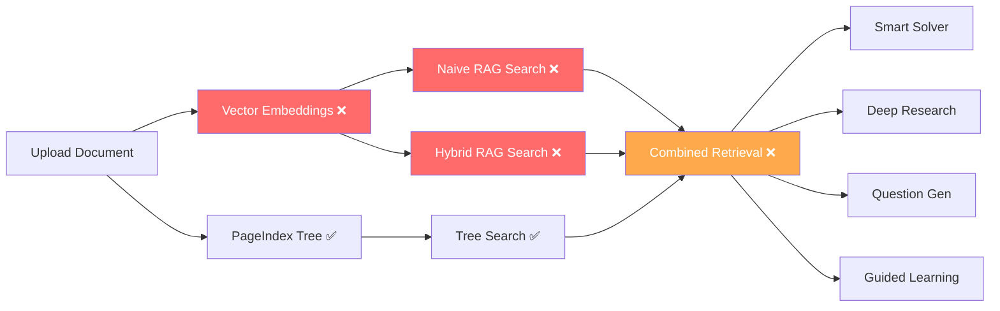

# UDIP — Next Development Step Analysis

## Status Audit Results

After cross-referencing `STATUS.md` against the actual codebase, several phases were **under-reported**:

| Phase | STATUS.md Said | Actual Code State | Updated To |
|-------|---------------|-------------------|------------|
| 5 — KV Cache Config | 🟨 PLANNED | `system.py` has real cache endpoints wired to ModelManager | ✅ COMPLETE |
| 6 — Benchmark Harness | 🟨 PLANNED | `benchmark_runner.py` (17KB) exists + routes wired | ✅ COMPLETE |
| 7 — Metrics Endpoints | 🟨 PLANNED | All `/metrics/*` routes return real data | ✅ COMPLETE |
| 8 — Dashboard | ⚠️ PARTIAL | Dashboard components consume real backend | ✅ COMPLETE |
| Telemetry Plan Tasks 1-4 | ⬜ Pending | Code implements all 4 tasks | ✅ Done |

> [!IMPORTANT]
> The previous plan (`2026-04-06-system-telemetry-api.md`) is **fully implemented** but was never marked complete. STATUS.md has been updated to reflect reality.

---

## Next Step: Phase 10 — Vector KB Builder + Hybrid RAG

### Why This Is The #1 Priority

**3 out of 4 retrieval modes are dead** because there's no vector data. This blocks every downstream feature.

### Plan Summary — 6 Tasks

| Task | Deliverable | New Files | Modified Files |
|------|-------------|-----------|----------------|
| **1** | Embedding Service | `embedding_service.py`, `test_embedding_service.py` | `lm_studio_client.py` (add `embed()`) |
| **2** | Text Chunker | `text_chunker.py`, `test_text_chunker.py` | — |
| **3** | Vector Store | `test_vector_store.py` | `vector_kb.py`, `hybrid_rag.py` |
| **4** | Ingestion Integration | — | `knowledge.py`, `main.py` |
| **5** | Retrieval Verification | `test_e2e_retrieval.py` | `retrieval.py` |
| **6** | Status Update | — | `STATUS.md` |

### Key Design Decisions

- **numpy-based cosine similarity** — No external vector DB (per PRD scope). Sufficient for <100K chunks.
- **Parallel pipelines** — Tree + embedding generation run concurrently via `asyncio.gather`.
- **Storage format** — `.npy` arrays + `.json` metadata, one pair per document.
- **Default chunking** — 512 tokens, 64 overlap, recursive character splitting.
- **Embedding model** — Snowflake Arctic Embed M (768 dim, ~0.5 GB VRAM) via LM Studio.

---

## Future Phase Roadmap

| Phase | Feature | Depends On | Priority |
|-------|---------|-----------|----------|
| **10** ← NEXT | Vector KB Builder + Hybrid RAG | — | 🔴 HIGH |
| 11 | Smart Solver Dual-Loop Agents (FR-3) | Phase 10 | 🟠 HIGH |
| 12 | Question Generator (FR-4) | Phase 10, 11 | 🟡 MEDIUM |
| 13 | Guided Learning (FR-5) | Phase 10, 11 | 🟡 MEDIUM |
| 14 | Deep Research (FR-6) | Phase 10, 11 | 🟡 MEDIUM |
| 15 | Content Creation — IdeaGen, Co-Writer (FR-7) | Phase 11 | 🟢 LOW |

---

## Files Created/Updated

| File | Action |
|------|--------|
| [STATUS.md](file:///c:/Users/priya/projects/Deep/docs/superpowers/STATUS.md) | Updated — corrected phase completion, added Phase 10 |
| [2026-04-26-vector-kb-hybrid-rag.md](file:///c:/Users/priya/projects/Deep/docs/superpowers/plans/2026-04-26-vector-kb-hybrid-rag.md) | Created — detailed 6-task implementation plan |
